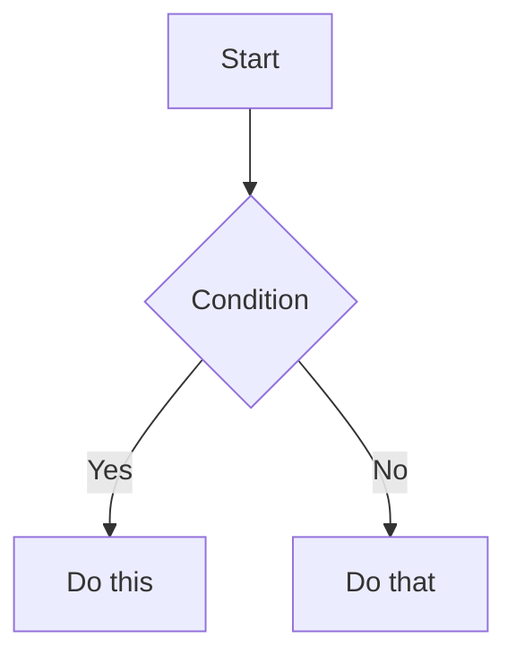

# 🤝 Contributing to Frontend Engineering Handbook

> **Thank you for wanting to contribute.** This handbook exists because engineers share what they know. Every correction, clarification, new section, and code example makes it more valuable for the entire community.

This guide explains how to contribute effectively — from fixing a typo to adding an entirely new topic section.

---

## 📋 Table of Contents

1. [Before You Contribute](#1-before-you-contribute)
2. [Types of Contributions](#2-types-of-contributions)
3. [Quality Bar — What Gets Merged](#3-quality-bar--what-gets-merged)
4. [Content Style Guide](#4-content-style-guide)
5. [Code Example Standards](#5-code-example-standards)
6. [Diagram Standards](#6-diagram-standards)
7. [File and Folder Structure](#7-file-and-folder-structure)
8. [How to Submit a Contribution](#8-how-to-submit-a-contribution)
9. [Pull Request Checklist](#9-pull-request-checklist)
10. [Review Process](#10-review-process)
11. [What Gets Rejected (and Why)](#11-what-gets-rejected-and-why)
12. [Finding Issues to Work On](#12-finding-issues-to-work-on)
13. [Code of Conduct](#13-code-of-conduct)

---

## 1. Before You Contribute

### Read the Philosophy First

This handbook has a specific voice and standard. Before writing anything, understand what makes content fit here:

```
✅ This handbook IS:
  - Deep technical explanations with the WHY, not just the HOW
  - Production-level thinking (scale, memory, performance)
  - Vanilla JavaScript first (not framework-specific)
  - Honest about tradeoffs — good practice vs bad practice
  - Visual where a diagram beats a paragraph

❌ This handbook is NOT:
  - A tutorial site ("Here's how to build a todo app")
  - A framework reference (React docs, Vue docs)
  - A glossary of API methods
  - Surface-level explanations found in 100 other places
  - Opinion pieces without technical backing
```

### Check Existing Issues

Before starting work:

1. Search [open issues](../../issues) — your idea may already be tracked
2. Search [existing PRs](../../pulls) — someone may already be working on it
3. For large additions (new sections, major rewrites), **open an issue first** to discuss
4. For small fixes (typos, broken links, minor clarifications), submit a PR directly

---

## 2. Types of Contributions

### 🐛 Bug Fixes (Always Welcome)

- Incorrect code examples (code that doesn't run, wrong output)
- Factually wrong statements
- Broken Mermaid diagrams
- Dead links
- Typos or grammatical errors

**Process:** Submit a PR directly. No issue needed for small fixes.

---

### ✏️ Improvements to Existing Content

- Better code examples
- Clearer explanations of existing concepts
- Additional edge cases or gotchas
- Missing error handling in code examples
- More accurate diagram representations

**Process:** Open an issue describing what's unclear or incorrect, then submit a PR.

---

### 📄 New Sections Within Existing Files

- A new "Common Mistakes" entry
- An additional pattern in a patterns section
- A new real-world case study
- Additional exercises

**Process:** Open an issue with your proposed addition. If it fits the file's scope, submit a PR.

---

### 📁 New Files (Topics Not Yet Covered)

All planned files are listed in [`README.md`](./README.md). If you want to write one:

1. Open an issue claiming the file (e.g., "I'd like to write `browser-internals/04-layout-reflow.md`")
2. Wait for acknowledgment (prevents duplicate work)
3. Follow the content template below
4. Submit a PR when complete

**Process:** Claim via issue first.

---

### 🔧 Infrastructure / Meta

- Fixing the repository structure
- Improving the README
- Adding GitHub Actions for link checking
- Adding example demos

**Process:** Open an issue to discuss first.

---

## 3. Quality Bar — What Gets Merged

Every contribution must meet this bar:

### Technical Accuracy

- All code examples must be correct and runnable
- All statements must be technically accurate (cite sources for non-obvious claims)
- Browser/engine behavior must be verified (link to MDN, spec, or DevTools screenshot)
- Performance claims must be measurable (include benchmark or cite one)

### Depth Over Breadth

```
❌ "The event loop processes async callbacks."
   (Too shallow — this is in every beginner tutorial)

✅ "After each macrotask completes, the engine drains the entire microtask
    queue before allowing the browser to render a frame. This means a
    chain of Promise.resolve().then() calls can delay rendering even
    though each individual microtask is fast."
   (Explains the WHY and the real-world consequence)
```

### Originality

Content should not be copied from:

- MDN (we should go deeper than MDN)
- Other tutorials
- AI-generated text without engineering review

### The "Senior Engineer" Test

Ask yourself: _"Would a senior frontend engineer at a major tech company learn something new from this, or find this explanation clearer than what's currently out there?"_

If the answer is no, the content needs more depth.

---

## 4. Content Style Guide

### Voice and Tone

```
✅ Direct and precise:
   "Closures capture references, not values."

✅ Explains consequences:
   "This means if the variable changes after the closure is created,
    the closure sees the updated value — a common source of bugs in loops."

✅ Honest about tradeoffs:
   "Cache-first is fastest for the user, but you must explicitly
    invalidate stale entries — which adds complexity."

❌ Vague:
   "Closures are a useful JavaScript feature."

❌ Condescending:
   "As you probably know, closures work like this..."

❌ Overclaiming:
   "This is the best possible approach."
```

### Document Structure

Every document should follow this template:

```markdown
# [Number] — [Topic Name]

> **"[One-line quote that captures the essence of the topic]"**

[One paragraph introduction — what is this, why it matters]

---

## 📚 Table of Contents

1. [Concept Explanation](#)
2. [How It Works Internally](#)
3. [Real-World Use Cases](#)
4. [Good Practices](#)
5. [Bad Practices](#)
6. [Common Mistakes](#)
7. [Performance Implications](#) (if relevant)
8. [Interview-Level Explanation](#)
9. [Exercises](#)

---

## 1. Concept Explanation

...

## N. Interview-Level Explanation

> **"Question: ..."**

**Strong answer:**

> "Answer text..."

---

## N+1. Exercises

### Exercise N — [Title]

[Problem statement]

<details>
<summary>Answer</summary>

[Solution]

</details>

---

## 🔗 Related Topics

- [link](./path) — description

---

<div align="center">
**Next:** [next-file.md](./next-file.md) →
</div>
```

### Section Requirements

Every document **must** include:

| Section                                          | Required |
| ------------------------------------------------ | :------: |
| Opening quote                                    |    ✅    |
| Table of Contents                                |    ✅    |
| Concept explanation with WHY                     |    ✅    |
| At least one diagram (ASCII, Mermaid, or visual) |    ✅    |
| Code examples (annotated)                        |    ✅    |
| Good practices section                           |    ✅    |
| Bad practices section                            |    ✅    |
| Common mistakes section                          |    ✅    |
| Interview-level explanation                      |    ✅    |
| At least 2 exercises with solutions              |    ✅    |
| Related topics links                             |    ✅    |

---

## 5. Code Example Standards

### Annotation Style

```javascript
// ❌ Bad — no annotation, reader must infer
function debounce(fn, delay) {
  let id;
  return function (...args) {
    clearTimeout(id);
    id = setTimeout(() => fn.apply(this, args), delay);
  };
}

// ✅ Good — explains what and why
function debounce(fn, delay) {
  let timeoutId = null; // shared across all calls — lives in closure

  return function debounced(...args) {
    // Cancel any pending invocation — only the latest call matters
    clearTimeout(timeoutId);

    timeoutId = setTimeout(() => {
      timeoutId = null; // allow GC of the timeout reference
      fn.apply(this, args); // preserve `this` context from the call site
    }, delay);
  };
}
```

### Bad Practice Markers

Always use `// ❌` and `// ✅` markers to clearly distinguish:

```javascript
// ❌ BAD — triggers layout thrashing (explain why it's bad)
elements.forEach((el) => {
  el.style.width = el.offsetWidth + 10 + "px";
});

// ✅ GOOD — batch reads then writes
const widths = elements.map((el) => el.offsetWidth);
elements.forEach((el, i) => {
  el.style.width = widths[i] + 10 + "px";
});
```

### Code Must Be Runnable

All code examples must:

- Be syntactically valid modern JavaScript (ES2020+)
- Produce the documented output when executed
- Not depend on undeclared external variables (unless clearly marked as pseudocode)
- Include `// Output: ...` comments where the output is non-obvious

### Complexity Ladder

Build complexity gradually within a section:

```
1. Simplest possible example (demonstrates the concept only)
2. Realistic example (adds error handling, edge cases)
3. Production example (full implementation with all considerations)
```

---

## 6. Diagram Standards

### Use Mermaid for Flow Diagrams

````markdown

````

```

Supported diagram types:
- `flowchart` — flows, decision trees, processes
- `sequenceDiagram` — request/response, async flows
- `graph` — dependency graphs, architecture
- `stateDiagram-v2` — state machines

### Use ASCII for Inline Diagrams

For diagrams that appear inline within prose or code blocks:

```

Call Stack:
┌─────────────┐
│ inner() │ ← currently executing
├─────────────┤
│ outer() │ ← waiting
├─────────────┤
│ global │
└─────────────┘

```

Use `┌ ┐ └ ┘ ├ ┤ ─ │ ↑ ↓ ← → ↔ ▲ ▼ ◄ ►` for box drawing.

### Diagram Requirements

- Every diagram must have a title or caption explaining what it shows
- Complex diagrams must have a legend if symbols aren't self-explanatory
- Mermaid diagrams must render correctly (test in a Mermaid live editor)

---

## 7. File and Folder Structure

### Naming Convention

```

Format: [NN]-[topic-name].md
Examples:
01-execution-context.md
03-event-loop.md
12-web-workers.md

Rules:

- Two-digit zero-padded numbers
- Lowercase, hyphens (no spaces, no underscores)
- Descriptive but concise

```

### Where to Put New Files

```

New JavaScript concept → javascript-core/
New browser behavior → browser-internals/
New performance technique → performance/
New architecture pattern → architecture/ or system-design/
New rendering topic → rendering/
New design pattern → patterns/
New anti-pattern → anti-patterns/
New project → projects/[project-name]/
New interview question set → interview/
New exercise set → exercises/
New challenge → challenges/
Diagrams (standalone) → diagrams/

```

### Code Examples (Isolated Files)

For code examples that warrant their own runnable file:

```

examples/
event-loop/
01-basic-order.js
02-promise-timing.js
README.md ← explains each example

````

---

## 8. How to Submit a Contribution

### Step 1 — Fork the Repository

```bash
# Fork on GitHub (click "Fork" button)
# Then clone your fork:
git clone https://github.com/YOUR_USERNAME/frontend-engineering-handbook.git
cd frontend-engineering-handbook
````

### Step 2 — Create a Branch

```bash
# Branch naming convention:
# fix/[description]       — bug fixes
# add/[topic-name]        — new content
# improve/[topic-name]    — improvements to existing content
# docs/[description]      — meta/infrastructure

git checkout -b add/browser-internals-layout-reflow
git checkout -b fix/event-loop-example-output
git checkout -b improve/closures-memory-section
```

### Step 3 — Make Your Changes

Follow the style guide. Write your content. Test all code examples.

### Step 4 — Self-Review Checklist

Before pushing, review against the [PR Checklist](#9-pull-request-checklist) below.

### Step 5 — Push and Open PR

```bash
git add .
git commit -m "add: browser-internals/04-layout-reflow.md

- Complete layout and reflow deep dive
- Includes layout thrashing patterns
- Adds forced synchronous layout property list
- 3 exercises with solutions"

git push origin add/browser-internals-layout-reflow
```

Then open a Pull Request on GitHub with:

- A clear title describing what changed
- A description of what was added/changed and why
- Screenshots if you changed any diagrams or visual content

---

## 9. Pull Request Checklist

Before submitting, confirm every item:

### Content Quality

- [ ] The explanation covers the **WHY**, not just the HOW
- [ ] The content goes deeper than a typical tutorial or MDN article
- [ ] Every factual claim is accurate and verifiable
- [ ] Technical tradeoffs are acknowledged (nothing is presented as universally best)

### Code Examples

- [ ] All code examples are syntactically valid ES2020+
- [ ] Code examples produce the stated output when executed
- [ ] Bad practice examples are clearly marked with `// ❌`
- [ ] Good practice examples are clearly marked with `// ✅`
- [ ] Code comments explain WHY, not just WHAT
- [ ] Complex examples build from simple → realistic → production

### Document Structure

- [ ] Opening quote is present
- [ ] Table of Contents is present and links work
- [ ] Document includes at least one diagram
- [ ] Good Practices section is present
- [ ] Bad Practices section is present
- [ ] Common Mistakes section is present
- [ ] Interview-level explanation section is present
- [ ] At least 2 exercises with solutions (in `<details>` tags) are present
- [ ] Related Topics links are present

### Formatting

- [ ] Markdown renders correctly (check GitHub preview)
- [ ] Mermaid diagrams render correctly
- [ ] Code blocks specify language (` ```javascript `, not ` ``` `)
- [ ] No trailing whitespace
- [ ] File ends with a newline

### Links

- [ ] All internal links (`[text](./path)`) point to files that exist
- [ ] No broken external links

---

## 10. Review Process

### Timeline

- **Typo/broken link fixes:** Reviewed within 1–3 days
- **Code example fixes:** Reviewed within 3–7 days
- **New sections or significant additions:** Reviewed within 1–2 weeks

### What Reviewers Look For

Reviewers will check:

1. **Technical accuracy** — Is everything correct?
2. **Depth** — Does this go beyond surface-level?
3. **Style consistency** — Does it match the handbook's voice?
4. **Code quality** — Are examples clean, annotated, and runnable?
5. **Completeness** — Are required sections present?

### Responding to Review Feedback

- Address all reviewer comments before requesting re-review
- If you disagree with feedback, explain your reasoning — good technical discussion is welcome
- Don't take feedback personally — the goal is the best possible resource

---

## 11. What Gets Rejected (and Why)

Understanding rejections helps you not waste time:

### ❌ Framework-Specific Content Without Vanilla Context

```
❌ "Here's how React handles re-renders with useCallback"
✅ "Here's how function identity affects memoization, with examples
    in Vanilla JS and how React's useCallback builds on this"
```

This handbook is framework-agnostic. Framework content is only accepted when it illustrates a deeper concept with a Vanilla JS foundation.

### ❌ Surface-Level Explanations

```
❌ "Promises represent asynchronous values. You can chain .then() calls."
✅ Explain the state machine, the microtask integration, the chaining
    mechanics, what returning a Promise from .then() means internally
```

If it's in the first Google result for the topic, it's too shallow.

### ❌ Unverified Performance Claims

```
❌ "This approach is 10x faster."
✅ "In benchmarks with 1000 elements on an M1 MacBook, this approach
    measured 2ms vs 180ms for the thrashing version. Results vary
    by device and data size — profile your specific case."
```

Always qualify performance claims with context.

### ❌ AI-Generated Content Without Engineering Review

AI-generated text tends toward:

- Surface-level explanations
- Vague non-committal language ("it depends on various factors")
- Missing the counterintuitive edge cases that make content valuable

If you use AI assistance, use it for structure only — fill in the depth yourself.

### ❌ Content That Belongs in a Framework's Docs

```
❌ "How to use React Context"
❌ "Vue's Composition API explained"
❌ "Next.js app router guide"
```

This handbook teaches you to understand the browser and JavaScript engine, not how to use frameworks.

### ❌ Code Without Explanation

```
❌ A code block with no explanation of what it demonstrates or why it matters
✅ Every code block has context: what it shows, why it's good/bad, what to watch out for
```

---

## 12. Finding Issues to Work On

### Labels

| Label               | Meaning                                              |
| ------------------- | ---------------------------------------------------- |
| `good first issue`  | Smaller scope, good for first contributions          |
| `help wanted`       | Explicitly looking for contributors                  |
| `new content`       | A file that needs to be written                      |
| `needs improvement` | Existing content that needs depth or accuracy fixes  |
| `bug`               | Incorrect code, wrong output, broken diagram         |
| `discussion`        | Architecture or approach decisions — comment welcome |

### Files Still Needed

Many files in the repository structure are planned but not yet written. Check the repository for empty or stub files — these are high-value contributions.

Priority areas:

- `browser-internals/` — most files still needed
- `system-design/` — most files still needed
- `projects/` — all 11 projects need full implementation guides
- `interview/` — deep question sets needed

---

## 13. Code of Conduct

### The Short Version

- Be technically rigorous and honest
- Critique ideas, not people
- Assume good intent in others' contributions
- Give specific, actionable feedback
- Welcome people who are learning

### Technical Disagreements

This handbook will sometimes take opinionated positions on technical topics. If you believe a position is wrong:

1. Open an issue with your technical argument
2. Cite sources (MDN, spec, benchmarks, engine documentation)
3. Propose the change you'd make
4. Be open to counter-arguments

Technical debates are healthy and make the content better. Personal attacks are not.

### Reporting Issues

If you experience behavior that violates this code of conduct, open an issue tagged `conduct` or contact the maintainers directly.

---

## 🙏 Thank You

Every contribution — from fixing a single typo to writing a full section — makes this resource better for every engineer who uses it. The goal is a handbook that earns a permanent bookmark in every frontend engineer's browser.

If you have questions before contributing, open a [discussion](../../discussions). We're happy to help scope your contribution before you invest time writing it.

---

<div align="center">

**Ready to contribute?** → [Open an Issue](../../issues/new) or [Browse Good First Issues](../../issues?q=label%3A%22good+first+issue%22)

</div>
