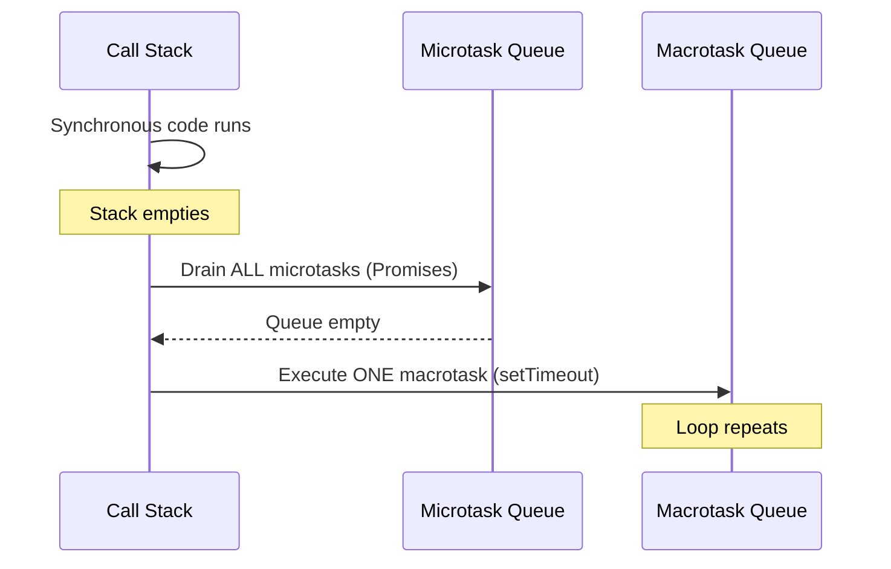
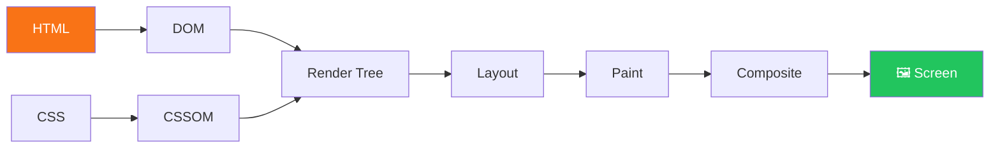
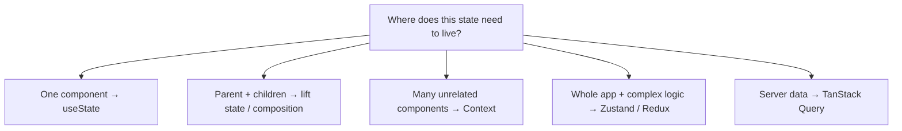

# 🧠 Frontend Engineering Handbook

> **A production-grade, open-source reference for intermediate to advanced frontend engineers.**
> Deep dives into JavaScript internals, browser mechanics, React patterns, performance engineering, system design, and real-world architecture — the way senior engineers actually think.

---

```
Not another tutorial. This is a field manual.
```

---

## 🌟 Why This Repository Exists

Most frontend learning resources teach you **how to use things**.

This handbook teaches you **how things work** — and more importantly, **why they behave the way they do at scale**.

If you've ever asked:

- _"Why does my UI freeze when I render 10,000 rows?"_
- _"What actually happens between a URL and a rendered pixel?"_
- _"How do I architect a frontend app that doesn't become a mess at 100k lines of code?"_
- _"What separates a senior frontend engineer from a mid-level one?"_

You're in the right place.

---

## 📊 At a Glance

| Section                 | Topics Covered                                                | Files |
| ----------------------- | ------------------------------------------------------------- | ----- |
| JavaScript Core         | Event loop, closures, memory, async, workers                  | 15    |
| Browser Internals       | Rendering pipeline, CRP, paint, composite, SSR                | 10    |
| Performance Engineering | DOM opt, virtualization, RAF, bundle, images                  | 12    |
| Frontend System Design  | Micro-frontends, state, architecture, tradeoffs               | 8     |
| Architecture Patterns   | Layered, clean, DDD, reactive                                 | 4     |
| Rendering Strategies    | DOM batching, virtual DOM, hydration, scheduling              | 5     |
| Caching Strategies      | HTTP, service worker, memory, CDN                             | 5     |
| Networking              | HTTP protocols, fetch, WebSockets, SSE, CORS                  | 4     |
| Security                | XSS, CSRF, CSP headers, auth patterns                         | 4     |
| Animations              | CSS, JavaScript WAAPI, compositor, micro-interactions         | 4     |
| React Patterns          | Composition, hooks, render props, HOCs, compound              | 5     |
| React Anti-Patterns     | Prop drilling, god components, stale closures, leaks          | 5     |
| Debugging               | Chrome DevTools, React DevTools, strategies, error boundaries | 4     |
| Testing                 | Unit, integration, E2E                                        | 3     |
| Interview Prep          | JS questions, React questions, system design, behavioral      | 4     |
| Exercises               | JavaScript, React, performance                                | 3     |
| Challenges              | Virtualized list, state manager, mini React                   | 3     |
| Projects                | 11 production-grade full project guides                       | 11    |
| Examples                | Isolated copy-paste reference implementations                 | 1     |
| Diagrams                | Mermaid architecture diagrams                                 | 1     |

**Total: 116 files · 3.7 MB of content**

---

## 🗂️ Repository Structure

```
frontend-engineering-handbook/
│
├── README.md                              ← You are here
├── ROADMAP.md                             ← Learning path & order
├── CONTRIBUTING.md                        ← How to contribute
│
├── docs/                                  ← Reference documents
│   ├── glossary.md                        ← 100+ term glossary
│   └── mental-models.md                   ← How senior engineers think
│
├── javascript-core/                       ← JS engine internals (15 files)
│   ├── 01-variables-and-data-types.md
│   ├── 02-operators-and-expressions.md
│   ├── 03-control-flow.md
│   ├── 04-functions-fundamentals.md
│   ├── 05-arrays-and-iteration.md
│   ├── 06-objects-and-destructuring.md
│   ├── 07-strings-and-regex.md
│   ├── 08-error-handling.md
│   ├── 09-es6-modern-syntax.md
│   ├── 10-modules-and-bundling.md
│   ├── 11-iterators-and-generators.md
│   ├── 12-proxy-reflect-and-metaprogramming.md
│   ├── 13-typed-arrays-and-binary-data.md
│   ├── 14-execution-context.md
│   ├── 15-call-stack.md
│   ├── 16-event-loop.md
│   ├── 17-microtask-vs-macrotask.md
│   ├── 18-closures.md
│   ├── 19-prototypes.md
│   ├── 20-scope-chain.md
│   ├── 21-memory-management.md
│   ├── 22-garbage-collection.md
│   ├── 23-async-patterns.md
│   ├── 24-promise-internals.md
│   ├── 25-web-workers.md
│   ├── 26-service-workers.md
│   ├── 27-observer-patterns.md
│   └── 28-pub-sub-systems.md
│
├── browser-internals/                     ← How browsers actually work (10 files)
│   ├── 01-rendering-pipeline.md
│   ├── 02-dom-tree-creation.md
│   ├── 03-cssom.md
│   ├── 04-layout-reflow.md
│   ├── 05-paint-repaint.md
│   ├── 06-composite-layers.md
│   ├── 07-gpu-acceleration.md
│   ├── 08-critical-rendering-path.md
│   ├── 09-browser-caching.md
│   └── 10-ssr-csr-isr-streaming.md
│
├── performance/                           ← Performance engineering (12 files)
│   ├── 01-dom-optimization.md
│   ├── 02-virtualization-windowing.md
│   ├── 03-layout-thrashing.md
│   ├── 04-raf-optimization.md
│   ├── 05-memory-leaks.md
│   ├── 06-event-delegation.md
│   ├── 07-memoization.md
│   ├── 08-bundle-optimization.md
│   ├── 09-intersection-observer.md
│   ├── 10-canvas-optimization.md
│   ├── 11-svg-optimization.md
│   └── 12-large-data-rendering.md
│
├── system-design/                         ← Frontend system design (8 files)
│   ├── 01-large-scale-architecture.md
│   ├── 02-feature-based-structure.md
│   ├── 03-micro-frontends.md
│   ├── 04-state-management-design.md
│   ├── 05-config-driven-ui.md
│   ├── 06-event-driven-frontend.md
│   ├── 07-plugin-systems.md
│   └── 08-design-tradeoffs.md
│
├── architecture/                          ← Architectural patterns (4 files)
│   ├── 01-layered-architecture.md
│   ├── 02-clean-architecture.md
│   ├── 03-domain-driven-design.md
│   └── 04-reactive-architecture.md
│
├── rendering/                             ← Rendering deep dive (5 files)
│   ├── 01-dom-batching.md
│   ├── 02-virtual-dom.md
│   ├── 03-cooperative-scheduling.md
│   ├── 04-paint-optimization.md
│   └── 05-hydration-patterns.md
│
├── caching/                               ← All caching strategies (5 files)
│   ├── 01-http-caching.md
│   ├── 02-service-worker-cache.md
│   ├── 03-memory-caching.md
│   ├── 04-data-caching.md
│   └── 05-cdn-strategies.md
│
├── networking/                            ← Networking engineering (4 files)
│   ├── 01-http-protocols.md
│   ├── 02-fetch-and-xhr.md
│   ├── 03-websockets-sse.md
│   └── 04-cors-and-security.md
│
├── security/                              ← Frontend security (4 files)
│   ├── 01-xss.md
│   ├── 02-csrf.md
│   ├── 03-headers.md
│   └── 04-auth-patterns.md
│
├── animations/                            ← High-performance animations (4 files)
│   ├── 01-css-animations.md
│   ├── 02-javascript-animations.md
│   ├── 03-compositor-animations.md
│   └── 04-micro-interactions.md
│
├── patterns/                              ← React patterns (5 files)
│   ├── 01-component-composition.md
│   ├── 02-custom-hooks.md
│   ├── 03-render-props-hoc.md
│   ├── 04-controlled-uncontrolled.md
│   └── 05-compound-components.md
│
├── anti-patterns/                         ← What NOT to do (5 files)
│   ├── 01-prop-drilling.md
│   ├── 02-god-components.md
│   ├── 03-premature-optimization.md
│   ├── 04-stale-closures.md
│   └── 05-memory-leaks.md
│
├── testing/                               ← Testing strategies (3 files)
│   ├── 01-unit-testing.md
│   ├── 02-integration-testing.md
│   └── 03-e2e-testing.md
│
├── debugging/                             ← DevTools mastery (4 files)
│   ├── 01-chrome-devtools.md
│   ├── 02-react-devtools.md
│   ├── 03-debugging-strategies.md
│   └── 04-error-boundaries.md
│
├── interview/                             ← Senior interview prep (4 files)
│   ├── 01-javascript-questions.md
│   ├── 02-react-questions.md
│   ├── 03-system-design-questions.md
│   └── 04-behavioral-questions.md
│
├── exercises/                             ← Hands-on practice (3 files)
│   ├── 01-javascript-exercises.md
│   ├── 02-react-exercises.md
│   └── 03-performance-exercises.md
│
├── challenges/                            ← Build-it-from-scratch (3 files)
│   ├── 01-build-a-virtualized-list.md
│   ├── 02-build-a-state-management-library.md
│   └── 03-build-a-mini-react.md
│
├── projects/                              ← Full project guides (11 files)
│   ├── 01-realtime-chat-application.md
│   ├── 02-ecommerce-product-page.md
│   ├── 03-kanban-board.md
│   ├── 04-markdown-editor.md
│   ├── 05-analytics-dashboard.md
│   ├── 06-infinite-scroll-gallery.md
│   ├── 07-multistep-form-wizard.md
│   ├── 08-authentication-system.md
│   ├── 09-notification-system.md
│   ├── 10-file-upload-system.md
│   └── 11-component-library.md
│
├── examples/                              ← Isolated reference code
│   └── code-examples.md                  ← 40+ copy-paste patterns
│
└── diagrams/                              ← Mermaid architecture diagrams
    └── architecture-diagrams.md           ← 12 key diagrams
```

---

## 🚀 Quick Start — Where to Begin

Follow the structured learning path in [`ROADMAP.md`](./ROADMAP.md), or jump directly to what you need:

| I want to learn...                        | Start here                                                                                       |
| ----------------------------------------- | ------------------------------------------------------------------------------------------------ |
| How the browser renders a page            | [`browser-internals/01-rendering-pipeline.md`](./browser-internals/01-rendering-pipeline.md)     |
| JavaScript closures and scope             | [`javascript-core/05-closures.md`](./javascript-core/05-closures.md)                             |
| The event loop (Promise/setTimeout order) | [`javascript-core/03-event-loop.md`](./javascript-core/03-event-loop.md)                         |
| Why my UI freezes                         | [`rendering/03-cooperative-scheduling.md`](./rendering/03-cooperative-scheduling.md)             |
| Memory leaks                              | [`anti-patterns/05-memory-leaks.md`](./anti-patterns/05-memory-leaks.md)                         |
| React hooks (useEffect, useMemo, etc.)    | [`interview/02-react-questions.md`](./interview/02-react-questions.md)                           |
| React composition and patterns            | [`patterns/01-component-composition.md`](./patterns/01-component-composition.md)                 |
| React anti-patterns to avoid              | [`anti-patterns/01-prop-drilling.md`](./anti-patterns/01-prop-drilling.md)                       |
| Frontend system design                    | [`system-design/01-large-scale-architecture.md`](./system-design/01-large-scale-architecture.md) |
| Performance optimization                  | [`performance/01-dom-optimization.md`](./performance/01-dom-optimization.md)                     |
| Secure authentication                     | [`security/04-auth-patterns.md`](./security/04-auth-patterns.md)                                 |
| Chrome DevTools mastery                   | [`debugging/01-chrome-devtools.md`](./debugging/01-chrome-devtools.md)                           |
| Interview prep (JS)                       | [`interview/01-javascript-questions.md`](./interview/01-javascript-questions.md)                 |
| Interview prep (system design)            | [`interview/03-system-design-questions.md`](./interview/03-system-design-questions.md)           |
| Build a project                           | [`projects/`](./projects/)                                                                       |
| Practice exercises                        | [`exercises/`](./exercises/)                                                                     |
| Deep build challenges                     | [`challenges/`](./challenges/)                                                                   |
| Quick code reference                      | [`examples/code-examples.md`](./examples/code-examples.md)                                       |
| Architecture diagrams                     | [`diagrams/architecture-diagrams.md`](./diagrams/architecture-diagrams.md)                       |

---

## 🔥 Highlighted Sections

### 🧬 JavaScript Event Loop



> Full deep dive → [`javascript-core/03-event-loop.md`](./javascript-core/03-event-loop.md)

---

### 🖥️ Browser Rendering Pipeline



> Full walkthrough → [`browser-internals/01-rendering-pipeline.md`](./browser-internals/01-rendering-pipeline.md)

---

### ⚡ Compositor-Only Animations

```
✅  transform: translate/scale/rotate  →  compositor thread  →  never drops frames
✅  opacity                             →  compositor thread  →  never drops frames
❌  width / height / margin            →  layout + paint     →  can cause jank
❌  background-color / border          →  paint              →  can cause jank
```

> Full guide → [`animations/03-compositor-animations.md`](./animations/03-compositor-animations.md)

---

### 🏗️ State Management Decision Tree



> Full guide → [`system-design/04-state-management-design.md`](./system-design/04-state-management-design.md)

---

## 🛠️ Projects

| #   | Project                                                             | Key Concepts                                       |
| --- | ------------------------------------------------------------------- | -------------------------------------------------- |
| 1   | [Real-Time Chat](./projects/01-realtime-chat-application.md)        | WebSocket, optimistic UI, virtualized messages     |
| 2   | [E-Commerce Product Page](./projects/02-ecommerce-product-page.md)  | Variant selection, LCP, SEO, structured data       |
| 3   | [Kanban Board](./projects/03-kanban-board.md)                       | Drag-and-drop, fractional indexing, a11y           |
| 4   | [Markdown Editor](./projects/04-markdown-editor.md)                 | Web Worker parsing, scroll sync, autosave          |
| 5   | [Analytics Dashboard](./projects/05-analytics-dashboard.md)         | Independent widget loading, LTTB downsampling      |
| 6   | [Infinite Scroll Gallery](./projects/06-infinite-scroll-gallery.md) | Masonry layout, memory management, blur-up         |
| 7   | [Multi-Step Form Wizard](./projects/07-multistep-form-wizard.md)    | State machine, conditional branching, draft save   |
| 8   | [Authentication System](./projects/08-authentication-system.md)     | Tokens, OAuth PKCE, MFA, protected routes          |
| 9   | [Notification System](./projects/09-notification-system.md)         | Toast stack, priority, real-time, persistence      |
| 10  | [File Upload System](./projects/10-file-upload-system.md)           | Chunked upload, resume, compression, concurrency   |
| 11  | [Component Library](./projects/11-component-library.md)             | Design tokens, a11y-first, tree-shaking, Storybook |

---

## 🧗 Challenges (Build from Scratch)

| Challenge                                                            | What You Build                                     | Key Learning                                  |
| -------------------------------------------------------------------- | -------------------------------------------------- | --------------------------------------------- |
| [Virtualized List](./challenges/01-build-a-virtualized-list.md)      | Variable-height DOM virtualization in 5 stages     | Prefix sums, binary search, scroll velocity   |
| [State Manager](./challenges/02-build-a-state-management-library.md) | Zustand/Redux-like library from scratch            | Pub/Sub, selectors, middleware, async actions |
| [Mini React](./challenges/03-build-a-mini-react.md)                  | createElement, reconciliation, hooks in ~200 lines | Why keys matter, why hook order matters       |

---

## 📐 Format — What Every File Contains

Each document follows a consistent structure:

```
Opening quote (sets the mental framing)
  ↓
Table of contents with anchors
  ↓
Concept sections: WHAT + WHY + HOW IT WORKS INTERNALLY
  ↓
Annotated code (❌ bad practice → ✅ good practice)
  ↓
Good Practices / Bad Practices checklists
  ↓
Common Mistakes (with explanations)
  ↓
Interview-Level Explanation (how a senior engineer would answer)
  ↓
Exercises with hidden <details> solutions
  ↓
Related Topics links
```

---

## 📈 What You'll Be Able to Do After This

- ✅ Explain the full browser rendering pipeline from HTML bytes to pixels on screen
- ✅ Debug and fix UI freezing, memory leaks, and jank using Chrome DevTools profiler
- ✅ Design the architecture for a large-scale React application from scratch
- ✅ Reason through React's hooks model, reconciliation, and concurrent features
- ✅ Identify and eliminate prop drilling, stale closures, and god components
- ✅ Implement virtualization, chunked uploads, and optimistic UI from first principles
- ✅ Apply CSS and WAAPI animations that stay on the compositor thread at 60fps
- ✅ Build accessible, token-driven component libraries that tree-shake cleanly
- ✅ Pass senior frontend engineer technical interviews across JS, React, and system design

---

## 🎯 Who Is This For?

| Profile                    | Benefit                                       |
| -------------------------- | --------------------------------------------- |
| **Mid-level developers**   | Level up to senior-level thinking             |
| **Senior developers**      | Deep reference for production problems        |
| **Interview candidates**   | Prep for system design + deep JS/React rounds |
| **Tech leads**             | Architecture patterns for large-scale apps    |
| **Self-taught developers** | Fill gaps in CS/browser/React fundamentals    |

**Prerequisites:** Comfortable with JavaScript ES6+, basic React (hooks), async programming.

---

## 🤝 Contributing

This is an open-source handbook that grows with the community.

- 📖 Found a mistake? [Open an issue](../../issues)
- ✍️ Want to add a section? [Read CONTRIBUTING.md](./CONTRIBUTING.md)
- 💬 Discuss a topic? [Start a discussion](../../discussions)
- ⭐ Find it useful? Star the repo — it helps others find it

All contributions must meet the quality bar: **depth over breadth, engineering mindset, explain the WHY**.

---

## 📄 License

MIT License — free to use, share, and adapt. Attribution appreciated.

---

## ⭐ Acknowledgements

Inspired by the work of:

- The V8, SpiderMonkey, and WebKit engineering teams whose public documentation shaped many sections here
- The React core team's blog posts, RFCs, and conference talks
- The Chrome DevTools team for their profiling tooling
- The broader web performance community (web.dev, MDN, performance.now() conference talks)

---

<div align="center">

**116 files · 22 sections · 3.7 MB of depth**

_Built for engineers who want to understand the web deeply._

**If this helps you grow as an engineer, consider starring ⭐ the repo.**

</div>
