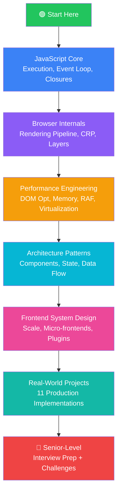
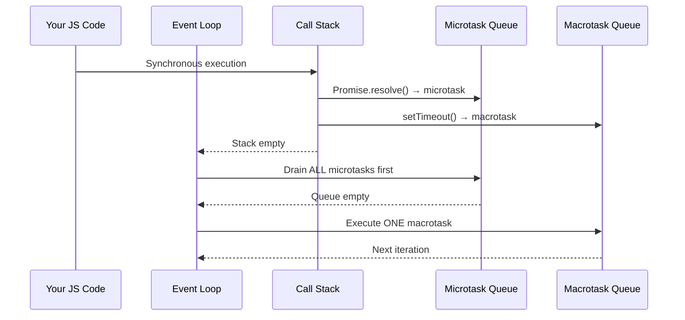
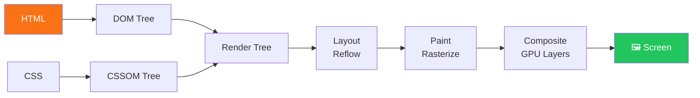
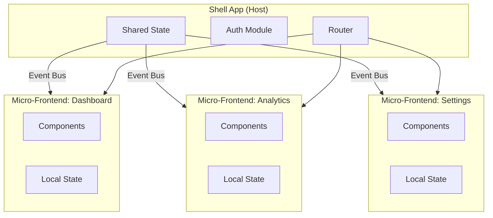

# 🧠 Frontend Engineering Handbook

> **A production-grade, open-source learning repository for intermediate to advanced frontend engineers.**
> Deep dives into Vanilla JavaScript, browser internals, performance engineering, system design, and real-world architecture — the way senior engineers actually think.

---

```
Not another tutorial. This is a field manual.
```

---

## 🌟 Why This Repository Exists

Most frontend learning resources teach you **how to use things**.

This handbook teaches you **how things work** — and more importantly, **why they behave the way they do at scale**.

If you've ever asked:

- _"Why does my UI freeze when I render 10,000 rows?"_
- _"What actually happens between a URL and a rendered pixel?"_
- _"How do I architect a frontend app that doesn't become a mess at 100k lines of code?"_
- _"What separates a senior frontend engineer from a mid-level one?"_

You're in the right place.

---

## 📊 At a Glance

| Category                | Topics Covered                                | Depth Level              |
| ----------------------- | --------------------------------------------- | ------------------------ |
| JavaScript Core         | Event loop, closures, memory, async, workers  | 🔴 Advanced              |
| Browser Internals       | Rendering pipeline, CRP, paint, composite     | 🔴 Advanced              |
| Performance Engineering | DOM opt, virtualization, RAF, memory leaks    | 🔴 Advanced              |
| Frontend System Design  | Micro-frontends, state, architecture patterns | 🔴 Advanced              |
| Vanilla JS Architecture | Component systems, reactivity, DOM diffing    | 🔴 Advanced              |
| Rendering Optimization  | Reflow, repaint, layout thrashing, GPU        | 🔴 Advanced              |
| Caching Strategies      | HTTP, service worker, memory, IndexedDB       | 🟡 Intermediate–Advanced |
| Animations              | RAF, WAAPI, CSS compositor, canvas            | 🟡 Intermediate–Advanced |
| Real-World Projects     | 10+ production-grade implementations          | 🔴 Advanced              |
| Interview Prep          | System design + deep JS questions             | 🔴 Advanced              |

---

## 🗂️ Repository Structure

```
frontend-engineering-handbook/
│
├── README.md                          ← You are here
├── ROADMAP.md                         ← Learning path & order
├── CONTRIBUTING.md                    ← How to contribute
│
├── docs/                              ← Deep-dive reference documents
│   ├── glossary.md
│   └── mental-models.md
│
├── javascript-core/                   ← Vanilla JS internals
│   ├── 01-execution-context.md
│   ├── 02-call-stack.md
│   ├── 03-event-loop.md
│   ├── 04-microtask-vs-macrotask.md
│   ├── 05-closures.md
│   ├── 06-prototypes.md
│   ├── 07-scope-chain.md
│   ├── 08-memory-management.md
│   ├── 09-garbage-collection.md
│   ├── 10-async-patterns.md
│   ├── 11-promise-internals.md
│   ├── 12-web-workers.md
│   ├── 13-service-workers.md
│   ├── 14-observer-patterns.md
│   └── 15-pub-sub-systems.md
│
├── browser-internals/                 ← How browsers actually work
│   ├── 01-rendering-pipeline.md
│   ├── 02-dom-tree-creation.md
│   ├── 03-cssom.md
│   ├── 04-layout-reflow.md
│   ├── 05-paint-repaint.md
│   ├── 06-composite-layers.md
│   ├── 07-gpu-acceleration.md
│   ├── 08-critical-rendering-path.md
│   ├── 09-browser-caching.md
│   └── 10-ssr-csr-isr-streaming.md
│
├── performance/                       ← Performance engineering in depth
│   ├── 01-dom-optimization.md
│   ├── 02-virtualization-windowing.md
│   ├── 03-layout-thrashing.md
│   ├── 04-raf-optimization.md
│   ├── 05-memory-leaks.md
│   ├── 06-event-delegation.md
│   ├── 07-memoization.md
│   ├── 08-bundle-optimization.md
│   ├── 09-intersection-observer.md
│   ├── 10-canvas-optimization.md
│   ├── 11-svg-optimization.md
│   └── 12-large-data-rendering.md
│
├── system-design/                     ← Frontend system design
│   ├── 01-large-scale-architecture.md
│   ├── 02-feature-based-structure.md
│   ├── 03-micro-frontends.md
│   ├── 04-state-management-design.md
│   ├── 05-config-driven-ui.md
│   ├── 06-event-driven-frontend.md
│   ├── 07-plugin-systems.md
│   └── 08-design-tradeoffs.md
│
├── architecture/                      ← Patterns for scalable frontend
│   ├── 01-component-architecture.md
│   ├── 02-data-flow-patterns.md
│   ├── 03-module-patterns.md
│   └── 04-plugin-architecture.md
│
├── rendering/                         ← Rendering strategies deep dive
│   ├── 01-dom-batching.md
│   ├── 02-fragment-usage.md
│   ├── 03-cooperative-scheduling.md
│   ├── 04-incremental-rendering.md
│   └── 05-ui-freezing-solutions.md
│
├── caching/                           ← All caching strategies
│   ├── 01-http-caching.md
│   ├── 02-service-worker-cache.md
│   ├── 03-memory-caching.md
│   ├── 04-indexeddb-strategies.md
│   └── 05-cache-invalidation.md
│
├── networking/                        ← Frontend networking engineering
│   ├── 01-http2-http3.md
│   ├── 02-websockets.md
│   ├── 03-request-batching.md
│   └── 04-prefetching-preloading.md
│
├── security/                          ← Frontend security
│   ├── 01-xss.md
│   ├── 02-csp.md
│   ├── 03-cors.md
│   └── 04-secure-storage.md
│
├── animations/                        ← High-performance animations
│   ├── 01-css-vs-js-animations.md
│   ├── 02-waapi.md
│   ├── 03-compositor-animations.md
│   └── 04-canvas-animations.md
│
├── patterns/                          ← Design patterns in frontend
│   ├── 01-observer.md
│   ├── 02-mediator.md
│   ├── 03-command.md
│   ├── 04-strategy.md
│   └── 05-proxy-pattern.md
│
├── anti-patterns/                     ← What NOT to do (and why)
│   ├── 01-dom-abuse.md
│   ├── 02-memory-leak-patterns.md
│   ├── 03-layout-thrashing-causes.md
│   ├── 04-event-listener-abuse.md
│   └── 05-blocking-render-patterns.md
│
├── testing/                           ← Frontend testing strategies
│   ├── 01-unit-testing-vanilla.md
│   ├── 02-performance-testing.md
│   └── 03-visual-regression.md
│
├── debugging/                         ← DevTools mastery
│   ├── 01-performance-tab.md
│   ├── 02-memory-tab.md
│   ├── 03-profiling-strategies.md
│   └── 04-flame-graphs.md
│
├── examples/                          ← Isolated code examples per topic
│   ├── event-loop/
│   ├── virtual-scroll/
│   ├── dom-diffing/
│   ├── raf-animation/
│   └── memory-leaks/
│
├── projects/                          ← Full production-grade projects
│   ├── 01-virtualized-table/
│   ├── 02-infinite-scroll/
│   ├── 03-topology-visualizer/
│   ├── 04-drag-drop-dashboard/
│   ├── 05-canvas-rendering-engine/
│   ├── 06-svg-connection-engine/
│   ├── 07-frontend-cache-layer/
│   ├── 08-custom-state-manager/
│   ├── 09-realtime-dashboard/
│   ├── 10-browser-code-editor/
│   └── 11-image-optimizer-viewer/
│
├── interview/                         ← Senior-level interview prep
│   ├── 01-js-deep-questions.md
│   ├── 02-system-design-questions.md
│   ├── 03-performance-questions.md
│   └── 04-browser-questions.md
│
├── exercises/                         ← Hands-on practice problems
│   ├── 01-event-loop-exercises.md
│   ├── 02-memory-optimization-challenges.md
│   └── 03-rendering-exercises.md
│
├── challenges/                        ← Advanced engineering challenges
│   ├── 01-build-virtual-dom.md
│   ├── 02-implement-state-manager.md
│   └── 03-build-event-bus.md
│
├── diagrams/                          ← Mermaid & visual architecture diagrams
│   ├── browser-rendering-pipeline.md
│   ├── event-loop-flow.md
│   └── micro-frontend-architecture.md
│
└── assets/                            ← Images, screenshots, benchmarks
    ├── screenshots/
    └── benchmarks/
```

---

## 🚀 Quick Start — Where to Begin

**If you're new to this repo**, follow the roadmap in [`ROADMAP.md`](./ROADMAP.md).

**Jump directly to a topic:**

| I want to learn...             | Start here                                                                                       |
| ------------------------------ | ------------------------------------------------------------------------------------------------ |
| How the browser renders a page | [`browser-internals/01-rendering-pipeline.md`](./browser-internals/01-rendering-pipeline.md)     |
| Why my UI freezes              | [`rendering/05-ui-freezing-solutions.md`](./rendering/05-ui-freezing-solutions.md)               |
| Memory leaks in JS             | [`performance/05-memory-leaks.md`](./performance/05-memory-leaks.md)                             |
| Frontend system design         | [`system-design/01-large-scale-architecture.md`](./system-design/01-large-scale-architecture.md) |
| Event loop internals           | [`javascript-core/03-event-loop.md`](./javascript-core/03-event-loop.md)                         |
| How to optimize large lists    | [`performance/02-virtualization-windowing.md`](./performance/02-virtualization-windowing.md)     |
| Build a project                | [`projects/`](./projects/)                                                                       |
| Prepare for interviews         | [`interview/`](./interview/)                                                                     |

---

## 🧭 Learning Roadmap Overview



**Estimated time:** 3–6 months for full coverage (studying 1–2 hours/day)

---

## 📚 Core Principles of This Handbook

### 1. Explain the WHY, not just the HOW

Every topic answers:

- What is this concept?
- Why does it exist?
- What happens internally when you use it?
- What goes wrong at scale?
- How do you fix it in production?

### 2. Good Practice vs Bad Practice — Every Topic

Each major section contains side-by-side comparisons:

```
❌ Bad Practice       →      ✅ Good Practice
Why it fails at scale        Why it works at scale
```

### 3. Real Profiling, Not Theory

Performance sections include actual Chrome DevTools screenshots, flame graph walkthroughs, and before/after FPS comparisons — not just theoretical advice.

### 4. Production Thinking

Code examples are written the way senior engineers write production code:

- Error boundaries
- Edge case handling
- Memory cleanup
- Performance considerations baked in

---

## 🔥 Highlighted Sections

### 🧬 JavaScript Engine Internals



> Full walkthrough → [`javascript-core/03-event-loop.md`](./javascript-core/03-event-loop.md)

---

### 🖥️ Browser Rendering Pipeline



> Full walkthrough → [`browser-internals/01-rendering-pipeline.md`](./browser-internals/01-rendering-pipeline.md)

---

### ⚡ Why Large Loops Freeze Your UI

```javascript
// ❌ BAD — Blocks the main thread for 2+ seconds
function renderThousandNodes(data) {
  data.forEach((item) => {
    // 10,000 iterations
    const el = document.createElement("div");
    el.textContent = item.name;
    container.appendChild(el); // Forces reflow every iteration
  });
}

// ✅ GOOD — Cooperative scheduling with chunking
function renderThousandNodes(data, chunkSize = 100) {
  let index = 0;
  function processChunk() {
    const end = Math.min(index + chunkSize, data.length);
    const fragment = document.createDocumentFragment();
    for (; index < end; index++) {
      const el = document.createElement("div");
      el.textContent = data[index].name;
      fragment.appendChild(el);
    }
    container.appendChild(fragment); // Single reflow per chunk
    if (index < data.length) {
      requestIdleCallback(processChunk); // Yield to browser
    }
  }
  processChunk();
}
```

> Deep dive → [`rendering/03-cooperative-scheduling.md`](./rendering/03-cooperative-scheduling.md)

---

### 🏗️ Frontend System Design at Scale



> Deep dive → [`system-design/03-micro-frontends.md`](./system-design/03-micro-frontends.md)

---

## 🛠️ Real-World Projects Preview

| #   | Project                                                           | Key Concepts                                  | Difficulty |
| --- | ----------------------------------------------------------------- | --------------------------------------------- | ---------- |
| 1   | [Virtualized Data Table](./projects/01-virtualized-table/)        | DOM recycling, windowing, scroll events       | 🟡 Medium  |
| 2   | [Infinite Scroll System](./projects/02-infinite-scroll/)          | IntersectionObserver, pagination, prefetch    | 🟡 Medium  |
| 3   | [Topology Visualizer](./projects/03-topology-visualizer/)         | Canvas, thousands of nodes, WebGL             | 🔴 Hard    |
| 4   | [Drag-Drop Dashboard](./projects/04-drag-drop-dashboard/)         | Pointer events, constraints, persistence      | 🟡 Medium  |
| 5   | [Canvas Rendering Engine](./projects/05-canvas-rendering-engine/) | 2D context, layers, dirty rects               | 🔴 Hard    |
| 6   | [SVG Connection Engine](./projects/06-svg-connection-engine/)     | Path math, dynamic SVG, perf at scale         | 🔴 Hard    |
| 7   | [Frontend Cache Layer](./projects/07-frontend-cache-layer/)       | TTL, LRU, IndexedDB, service worker           | 🟡 Medium  |
| 8   | [Custom State Manager](./projects/08-custom-state-manager/)       | Proxy, subscription, immutability             | 🔴 Hard    |
| 9   | [Real-Time Dashboard](./projects/09-realtime-dashboard/)          | WebSockets, incremental DOM, batching         | 🔴 Hard    |
| 10  | [Browser Code Editor](./projects/10-browser-code-editor/)         | ContentEditable, syntax highlighting, history | 🔴 Hard    |
| 11  | [Image Optimizer Viewer](./projects/11-image-optimizer-viewer/)   | Canvas API, compression, workers              | 🟡 Medium  |

---

## 📈 What You'll Be Able to Do After This

After completing this handbook, you will be able to:

- ✅ Explain the full browser rendering pipeline from HTML bytes to pixels on screen
- ✅ Debug and fix UI freezing problems in production applications
- ✅ Design the architecture for a large-scale frontend application from scratch
- ✅ Identify and fix memory leaks using Chrome DevTools
- ✅ Implement virtualization and windowing for large datasets without a framework
- ✅ Write cooperative scheduling patterns that keep UIs smooth at 60fps
- ✅ Build production-level Vanilla JS components with proper lifecycle management
- ✅ Design micro-frontend systems with shared state and independent deployability
- ✅ Optimize canvas and SVG rendering for complex visualizations
- ✅ Ace senior frontend engineer technical interviews

---

## 🎯 Who Is This For?

| Profile                    | Benefit                                    |
| -------------------------- | ------------------------------------------ |
| **Mid-level developers**   | Level up to senior-level thinking          |
| **Senior developers**      | Deep reference for production problems     |
| **Interview candidates**   | Prep for system design + deep JS rounds    |
| **Tech leads**             | Architecture patterns for large-scale apps |
| **Self-taught developers** | Fill gaps in CS/browser fundamentals       |

**Prerequisites:** You should be comfortable with:

- JavaScript ES6+ syntax
- Basic DOM manipulation
- Async programming (Promises, async/await)
- Basic knowledge of at least one framework (helpful but not required)

---

## 🤝 Contributing

This is an open-source handbook that grows with the community.

- 📖 Found a mistake? [Open an issue](../../issues)
- ✍️ Want to add a section? [Read CONTRIBUTING.md](./CONTRIBUTING.md)
- 💬 Discuss a topic? [Start a discussion](../../discussions)
- ⭐ Find it useful? Star the repo — it helps others find it

All contributions must meet the quality bar: **depth over breadth, engineering mindset, explain the WHY**.

---

## 📄 License

MIT License — free to use, share, and adapt. Attribution appreciated.

---

## ⭐ Acknowledgements

Inspired by the work of:

- The V8, SpiderMonkey, and WebKit engineering teams whose public documentation shaped many sections here
- The Chrome DevTools team for their profiling tooling
- The broader web performance community (web.dev, MDN, performance.now() conference talks)

---

<div align="center">

**If this helps you grow as an engineer, consider starring ⭐ the repo.**

_Built for engineers who want to understand the web deeply._

</div>
