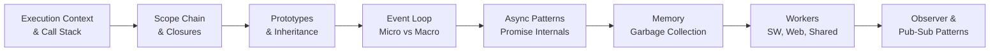
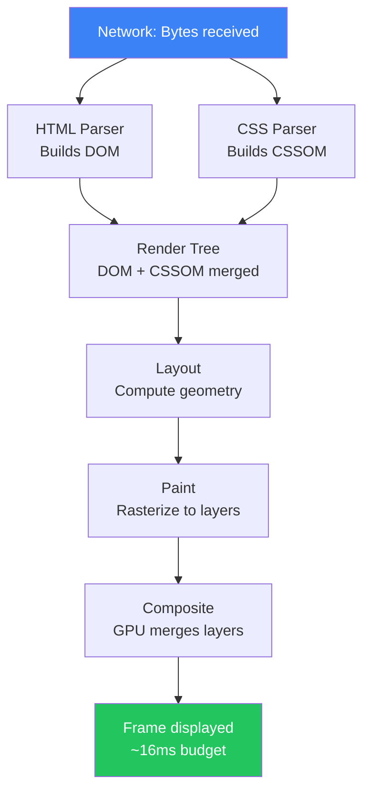
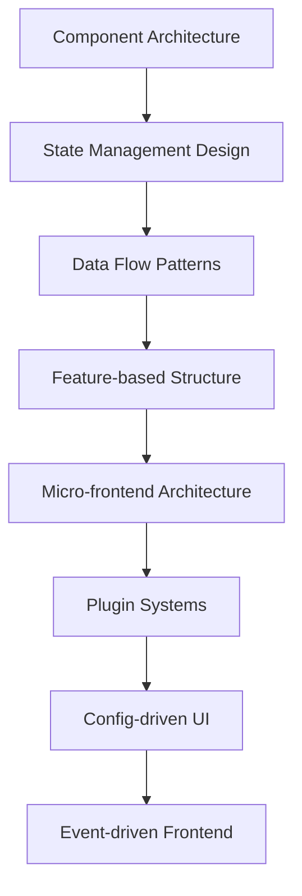

# 🗺️ Learning Roadmap

> **Your structured path from intermediate to senior frontend engineer.**
> Follow this roadmap in order, or jump to any phase that matches your current level.

---

## 📍 How to Use This Roadmap

1. **Assess yourself** using the self-assessment table below
2. **Pick your starting phase** (don't skip Phase 1 even if experienced — it has gaps-fillers)
3. **Study each topic** using the linked files
4. **Complete the exercises** at the end of each phase before moving on
5. **Build the projects** — reading alone won't make you a senior engineer

> 💡 **Rule of thumb:** If you can't explain a topic to someone else in plain English, you haven't learned it yet. Use the "interview-level explanation" sections in each topic to test yourself.

---

## 🧭 Self-Assessment

Before starting, honestly rate yourself on each area:

| Topic                                 | I've heard of it | I can use it | I can explain internals | I can debug production issues |
| ------------------------------------- | :--------------: | :----------: | :---------------------: | :---------------------------: |
| JavaScript event loop                 |                  |              |                         |                               |
| Browser rendering pipeline            |                  |              |                         |                               |
| Memory management in JS               |                  |              |                         |                               |
| DOM performance & reflow              |                  |              |                         |                               |
| Closures & scope chain                |                  |              |                         |                               |
| Async patterns (Promise, async/await) |                  |              |                         |                               |
| Web Workers                           |                  |              |                         |                               |
| Service Workers                       |                  |              |                         |                               |
| Frontend system design                |                  |              |                         |                               |
| Performance profiling (DevTools)      |                  |              |                         |                               |
| State management patterns             |                  |              |                         |                               |
| Micro-frontend architecture           |                  |              |                         |                               |

**Scoring:**

- Mostly "heard of it" → Start at **Phase 1**
- Mostly "can use it" → Start at **Phase 2**
- Mostly "can explain internals" → Start at **Phase 3**
- Mostly "can debug production" → Start at **Phase 4**, contribute to this repo!

---

## 🗓️ Time Estimates

| Phase   | Topics                       | Estimated Time | Goal                        |
| ------- | ---------------------------- | -------------- | --------------------------- |
| Phase 0 | Setup & mental models        | 1–2 days       | Orientation                 |
| Phase 1 | JavaScript Core Internals    | 3–4 weeks      | Deep JS mastery             |
| Phase 2 | Browser Internals            | 2–3 weeks      | Understand the engine       |
| Phase 3 | Performance Engineering      | 4–5 weeks      | Fix real perf problems      |
| Phase 4 | Architecture & System Design | 3–4 weeks      | Think at scale              |
| Phase 5 | Real-World Projects          | 6–8 weeks      | Build production-grade apps |
| Phase 6 | Interview Mastery            | 2–3 weeks      | Senior-level preparation    |

**Total:** ~5–6 months studying 1–2 hours/day

---

## 🟢 Phase 0 — Orientation (1–2 days)

**Goal:** Understand what this handbook is and how to study it effectively.

### Read First

- [ ] [`README.md`](../README.md) — Full overview
- [ ] [`docs/mental-models.md`](../docs/mental-models.md) — The mental models you need before diving in
- [ ] [`docs/glossary.md`](../docs/glossary.md) — Key terms used throughout

### Setup Your Study Environment

```
✅ Open Chrome DevTools Performance tab — you'll use it constantly
✅ Install Node.js for running code examples locally
✅ Clone this repository
✅ Create a personal notes folder — document what you learn
```

### Mindset Shift

Before continuing, internalize these principles:

> **"A senior engineer doesn't just know more APIs — they understand the system beneath the APIs."**

| Mid-level thinking           | Senior-level thinking                                                    |
| ---------------------------- | ------------------------------------------------------------------------ |
| "Which method should I use?" | "What happens internally when I call this?"                              |
| "Is this code correct?"      | "Does this code stay correct at 100× scale?"                             |
| "It works on my machine"     | "How does this behave under load, on slow networks, on low-end devices?" |
| "React handles re-renders"   | "What triggers re-renders and how do I control them?"                    |
| "setTimeout is a timer"      | "setTimeout is a macrotask that queues after microtasks drain"           |

---

## 🔵 Phase 1 — JavaScript Core Internals (3–4 weeks)

**Goal:** Understand JavaScript at the engine level, not just the syntax level.



### Week 1 — Execution Model

| Day | Topic             | File                                                                                    | Exercise                                                  |
| --- | ----------------- | --------------------------------------------------------------------------------------- | --------------------------------------------------------- |
| 1   | Execution Context | [`javascript-core/01-execution-context.md`](../javascript-core/01-execution-context.md) | Draw the execution context stack for a given code snippet |
| 2   | Call Stack        | [`javascript-core/02-call-stack.md`](../javascript-core/02-call-stack.md)               | Trace a recursive function's stack frames                 |
| 3   | Scope Chain       | [`javascript-core/07-scope-chain.md`](../javascript-core/07-scope-chain.md)             | Predict output of 5 scope chain puzzles                   |
| 4   | Closures          | [`javascript-core/05-closures.md`](../javascript-core/05-closures.md)                   | Build a module pattern using closures                     |
| 5   | Prototypes        | [`javascript-core/06-prototypes.md`](../javascript-core/06-prototypes.md)               | Implement inheritance without `class` keyword             |

### Week 2 — Concurrency Model

| Day | Topic                  | File                                                                                              | Exercise                                               |
| --- | ---------------------- | ------------------------------------------------------------------------------------------------- | ------------------------------------------------------ |
| 1–2 | Event Loop (deep)      | [`javascript-core/03-event-loop.md`](../javascript-core/03-event-loop.md)                         | Predict output of 10 event loop puzzles                |
| 3   | Microtask vs Macrotask | [`javascript-core/04-microtask-vs-macrotask.md`](../javascript-core/04-microtask-vs-macrotask.md) | Trace execution order of mixed Promise/setTimeout code |
| 4–5 | Async Patterns         | [`javascript-core/10-async-patterns.md`](../javascript-core/10-async-patterns.md)                 | Implement a rate limiter using async patterns          |

### Week 3 — Memory & Engine

| Day | Topic                   | File                                                                                      | Exercise                                      |
| --- | ----------------------- | ----------------------------------------------------------------------------------------- | --------------------------------------------- |
| 1–2 | Memory Management       | [`javascript-core/08-memory-management.md`](../javascript-core/08-memory-management.md)   | Find 3 memory leaks in provided code samples  |
| 3   | Garbage Collection      | [`javascript-core/09-garbage-collection.md`](../javascript-core/09-garbage-collection.md) | Profile memory in DevTools on a provided demo |
| 4   | Promise Internals       | [`javascript-core/11-promise-internals.md`](../javascript-core/11-promise-internals.md)   | Implement a basic Promise from scratch        |
| 5   | Deep clone optimization | [`javascript-core/10-async-patterns.md`](../javascript-core/10-async-patterns.md)         | Benchmark 4 deep clone strategies             |

### Week 4 — Workers & Patterns

| Day | Topic             | File                                                                                    | Exercise                                |
| --- | ----------------- | --------------------------------------------------------------------------------------- | --------------------------------------- |
| 1–2 | Web Workers       | [`javascript-core/12-web-workers.md`](../javascript-core/12-web-workers.md)             | Offload a heavy computation to a Worker |
| 3   | Service Workers   | [`javascript-core/13-service-workers.md`](../javascript-core/13-service-workers.md)     | Build an offline-capable page           |
| 4   | Observer Patterns | [`javascript-core/14-observer-patterns.md`](../javascript-core/14-observer-patterns.md) | Build a reactive data binding system    |
| 5   | Pub-Sub Systems   | [`javascript-core/15-pub-sub-systems.md`](../javascript-core/15-pub-sub-systems.md)     | Build a typed event bus                 |

### ✅ Phase 1 Completion Checklist

Before moving to Phase 2, you should be able to:

- [ ] Explain what happens when a JS engine parses and executes a file (step by step)
- [ ] Predict the output of complex event loop problems without running the code
- [ ] Explain the difference between `[[Prototype]]` and `.prototype`
- [ ] Write a closure-based module with private state
- [ ] Implement a basic Promise from scratch
- [ ] Find a memory leak in a provided codebase using Chrome DevTools Memory tab
- [ ] Explain when to use a Web Worker vs Service Worker vs Shared Worker
- [ ] Build a working pub-sub event system

---

## 🟣 Phase 2 — Browser Internals (2–3 weeks)

**Goal:** Understand what the browser does between receiving bytes and painting pixels.



### Week 1 — Rendering Pipeline

| Day | Topic                       | File                                                                                                    | Key Insight                          |
| --- | --------------------------- | ------------------------------------------------------------------------------------------------------- | ------------------------------------ |
| 1–2 | Rendering Pipeline overview | [`browser-internals/01-rendering-pipeline.md`](../browser-internals/01-rendering-pipeline.md)           | Every frame has a 16ms budget        |
| 3   | DOM Tree Creation           | [`browser-internals/02-dom-tree-creation.md`](../browser-internals/02-dom-tree-creation.md)             | Parsing is incremental and blockable |
| 4   | CSSOM                       | [`browser-internals/03-cssom.md`](../browser-internals/03-cssom.md)                                     | CSS is render-blocking by design     |
| 5   | Critical Rendering Path     | [`browser-internals/08-critical-rendering-path.md`](../browser-internals/08-critical-rendering-path.md) | Minimizing CRP = faster first paint  |

### Week 2 — Paint, Composite & GPU

| Day | Topic            | File                                                                                      | Key Insight                              |
| --- | ---------------- | ----------------------------------------------------------------------------------------- | ---------------------------------------- |
| 1–2 | Layout & Reflow  | [`browser-internals/04-layout-reflow.md`](../browser-internals/04-layout-reflow.md)       | Layout is expensive; reads/writes matter |
| 3   | Paint & Repaint  | [`browser-internals/05-paint-repaint.md`](../browser-internals/05-paint-repaint.md)       | Not all CSS triggers paint               |
| 4   | Composite Layers | [`browser-internals/06-composite-layers.md`](../browser-internals/06-composite-layers.md) | GPU layers skip layout + paint           |
| 5   | GPU Acceleration | [`browser-internals/07-gpu-acceleration.md`](../browser-internals/07-gpu-acceleration.md) | `will-change` creates compositor layers  |

### Week 3 — Advanced Browser Concepts

| Day | Topic                          | File                                                                                                |
| --- | ------------------------------ | --------------------------------------------------------------------------------------------------- |
| 1–2 | Browser Caching                | [`browser-internals/09-browser-caching.md`](../browser-internals/09-browser-caching.md)             |
| 3–4 | SSR vs CSR vs ISR vs Streaming | [`browser-internals/10-ssr-csr-isr-streaming.md`](../browser-internals/10-ssr-csr-isr-streaming.md) |
| 5   | Profiling with DevTools        | [`debugging/01-performance-tab.md`](../debugging/01-performance-tab.md)                             |

### ✅ Phase 2 Completion Checklist

- [ ] Draw the full browser rendering pipeline from memory
- [ ] Explain what triggers reflow vs repaint vs composite-only
- [ ] Name 5 CSS properties that are GPU-composited (don't trigger layout)
- [ ] Explain what `will-change: transform` does internally
- [ ] Read a Chrome DevTools Performance flamegraph and identify bottlenecks
- [ ] Explain the difference between SSR hydration and CSR bootstrap

---

## 🟡 Phase 3 — Performance Engineering (4–5 weeks)

**Goal:** Diagnose and fix real performance problems at a production level.

> This is the phase most developers skip — and it's what separates senior engineers from mid-level ones.

### Week 1 — DOM & Layout Performance

| Day | Topic                    | File                                                                          |
| --- | ------------------------ | ----------------------------------------------------------------------------- |
| 1–2 | DOM Optimization         | [`performance/01-dom-optimization.md`](../performance/01-dom-optimization.md) |
| 3   | Layout Thrashing         | [`performance/03-layout-thrashing.md`](../performance/03-layout-thrashing.md) |
| 4   | Event Delegation         | [`performance/06-event-delegation.md`](../performance/06-event-delegation.md) |
| 5   | Anti-patterns: DOM abuse | [`anti-patterns/01-dom-abuse.md`](../anti-patterns/01-dom-abuse.md)           |

### Week 2 — Memory & Leak Detection

| Day | Topic                       | File                                                                                      |
| --- | --------------------------- | ----------------------------------------------------------------------------------------- |
| 1–2 | Memory Leaks                | [`performance/05-memory-leaks.md`](../performance/05-memory-leaks.md)                     |
| 3   | Anti-patterns: Memory leaks | [`anti-patterns/02-memory-leak-patterns.md`](../anti-patterns/02-memory-leak-patterns.md) |
| 4   | Memory tab in DevTools      | [`debugging/02-memory-tab.md`](../debugging/02-memory-tab.md)                             |
| 5   | Memoization                 | [`performance/07-memoization.md`](../performance/07-memoization.md)                       |

### Week 3 — Rendering & Animation Performance

| Day | Topic                  | File                                                                                  |
| --- | ---------------------- | ------------------------------------------------------------------------------------- |
| 1–2 | RAF Optimization       | [`performance/04-raf-optimization.md`](../performance/04-raf-optimization.md)         |
| 3   | Cooperative Scheduling | [`rendering/03-cooperative-scheduling.md`](../rendering/03-cooperative-scheduling.md) |
| 4   | UI Freezing Solutions  | [`rendering/05-ui-freezing-solutions.md`](../rendering/05-ui-freezing-solutions.md)   |
| 5   | DOM Batching           | [`rendering/01-dom-batching.md`](../rendering/01-dom-batching.md)                     |

### Week 4 — Virtualization & Large Data

| Day | Topic                      | File                                                                                          |
| --- | -------------------------- | --------------------------------------------------------------------------------------------- |
| 1–3 | Virtualization & Windowing | [`performance/02-virtualization-windowing.md`](../performance/02-virtualization-windowing.md) |
| 4   | Incremental Rendering      | [`rendering/04-incremental-rendering.md`](../rendering/04-incremental-rendering.md)           |
| 5   | IntersectionObserver       | [`performance/09-intersection-observer.md`](../performance/09-intersection-observer.md)       |

### Week 5 — Canvas, SVG & Bundle

| Day | Topic                | File                                                                                  |
| --- | -------------------- | ------------------------------------------------------------------------------------- |
| 1–2 | Canvas Optimization  | [`performance/10-canvas-optimization.md`](../performance/10-canvas-optimization.md)   |
| 3   | SVG Optimization     | [`performance/11-svg-optimization.md`](../performance/11-svg-optimization.md)         |
| 4   | Large Data Rendering | [`performance/12-large-data-rendering.md`](../performance/12-large-data-rendering.md) |
| 5   | Bundle Optimization  | [`performance/08-bundle-optimization.md`](../performance/08-bundle-optimization.md)   |

### ✅ Phase 3 Completion Checklist

- [ ] Fix layout thrashing in a provided code sample
- [ ] Find and fix a memory leak using the DevTools Memory tab
- [ ] Implement a virtual scroll list from scratch (no library)
- [ ] Refactor a synchronous loop to use cooperative scheduling
- [ ] Profile a slow animation and fix it to run at 60fps
- [ ] Explain the difference between `requestAnimationFrame` and `requestIdleCallback`
- [ ] Implement event delegation for a dynamic list

---

## 🟠 Phase 4 — Architecture & System Design (3–4 weeks)

**Goal:** Think about frontend applications at the system level.



### Week 1 — Vanilla JS Architecture

| Day | Topic                  | File                                                                                        |
| --- | ---------------------- | ------------------------------------------------------------------------------------------- |
| 1–2 | Component Architecture | [`architecture/01-component-architecture.md`](../architecture/01-component-architecture.md) |
| 3   | Module Patterns        | [`architecture/03-module-patterns.md`](../architecture/03-module-patterns.md)               |
| 4   | Data Flow Patterns     | [`architecture/02-data-flow-patterns.md`](../architecture/02-data-flow-patterns.md)         |
| 5   | Plugin Architecture    | [`architecture/04-plugin-architecture.md`](../architecture/04-plugin-architecture.md)       |

### Week 2 — System Design Fundamentals

| Day | Topic                    | File                                                                                              |
| --- | ------------------------ | ------------------------------------------------------------------------------------------------- |
| 1–2 | Large-Scale Architecture | [`system-design/01-large-scale-architecture.md`](../system-design/01-large-scale-architecture.md) |
| 3   | Feature-based Structure  | [`system-design/02-feature-based-structure.md`](../system-design/02-feature-based-structure.md)   |
| 4   | State Management Design  | [`system-design/04-state-management-design.md`](../system-design/04-state-management-design.md)   |
| 5   | Design Tradeoffs         | [`system-design/08-design-tradeoffs.md`](../system-design/08-design-tradeoffs.md)                 |

### Week 3 — Advanced System Design

| Day | Topic                 | File                                                                                        |
| --- | --------------------- | ------------------------------------------------------------------------------------------- |
| 1–2 | Micro-frontends       | [`system-design/03-micro-frontends.md`](../system-design/03-micro-frontends.md)             |
| 3   | Config-driven UI      | [`system-design/05-config-driven-ui.md`](../system-design/05-config-driven-ui.md)           |
| 4   | Event-driven Frontend | [`system-design/06-event-driven-frontend.md`](../system-design/06-event-driven-frontend.md) |
| 5   | Plugin Systems        | [`system-design/07-plugin-systems.md`](../system-design/07-plugin-systems.md)               |

### Week 4 — Patterns & Anti-Patterns

| Day | Topic                | File                                                              |
| --- | -------------------- | ----------------------------------------------------------------- |
| 1   | Observer Pattern     | [`patterns/01-observer.md`](../patterns/01-observer.md)           |
| 2   | Mediator Pattern     | [`patterns/02-mediator.md`](../patterns/02-mediator.md)           |
| 3   | Proxy Pattern        | [`patterns/05-proxy-pattern.md`](../patterns/05-proxy-pattern.md) |
| 4   | Anti-patterns survey | [`anti-patterns/`](../anti-patterns/)                             |
| 5   | Caching Strategies   | [`caching/`](../caching/)                                         |

### ✅ Phase 4 Completion Checklist

- [ ] Design the folder structure for a 50-engineer frontend team
- [ ] Explain 3 tradeoffs between monolith and micro-frontend architectures
- [ ] Build a config-driven form renderer in Vanilla JS
- [ ] Implement a typed event bus that multiple modules communicate through
- [ ] Explain when to use a global store vs local component state

---

## 🔴 Phase 5 — Real-World Projects (6–8 weeks)

**Goal:** Apply everything by building production-grade implementations.

> Don't skip this phase. Reading without building creates an illusion of knowledge.

### Suggested Build Order


| Week | Project                                                              | What You Practice                         |
| ---- | -------------------------------------------------------------------- | ----------------------------------------- |
| 1    | [`Custom State Manager`](../projects/08-custom-state-manager/)       | Proxy, subscription model, immutability   |
| 2    | [`Virtualized Table`](../projects/01-virtualized-table/)             | DOM recycling, scroll performance         |
| 3    | [`Infinite Scroll`](../projects/02-infinite-scroll/)                 | IntersectionObserver, async data loading  |
| 4    | [`Frontend Cache Layer`](../projects/07-frontend-cache-layer/)       | LRU, TTL, IndexedDB integration           |
| 5    | [`Drag-Drop Dashboard`](../projects/04-drag-drop-dashboard/)         | Pointer events, geometry calculations     |
| 6    | [`SVG Connection Engine`](../projects/06-svg-connection-engine/)     | Dynamic SVG, path math, performance       |
| 7    | [`Canvas Rendering Engine`](../projects/05-canvas-rendering-engine/) | 2D context, dirty rectangles, layers      |
| 8    | [`Real-Time Dashboard`](../projects/09-realtime-dashboard/)          | WebSockets, incremental updates, batching |

### Build Principles

Every project should be built with these constraints:

- **No frameworks** — Vanilla JS only (unless the project explicitly calls for one)
- **No build tools initially** — understand what you're actually doing
- **Profile before optimizing** — use DevTools, measure first
- **Write your own tests** — even simple ones
- **Document the architecture** — pretend another engineer will maintain it

---

## ⚫ Phase 6 — Interview Mastery (2–3 weeks)

**Goal:** Prepare for senior-level frontend engineering interviews.

### Topic Coverage

| Week | Focus                   | Files                                                                                   |
| ---- | ----------------------- | --------------------------------------------------------------------------------------- |
| 1    | Deep JS questions       | [`interview/01-js-deep-questions.md`](../interview/01-js-deep-questions.md)             |
| 1    | Browser questions       | [`interview/04-browser-questions.md`](../interview/04-browser-questions.md)             |
| 2    | Performance questions   | [`interview/03-performance-questions.md`](../interview/03-performance-questions.md)     |
| 2–3  | System design questions | [`interview/02-system-design-questions.md`](../interview/02-system-design-questions.md) |

### Sample Senior-Level Interview Questions

**JavaScript Internals:**

- _"Explain the event loop. What's the difference between the microtask queue and the macrotask queue, and why does it matter?"_
- _"How does garbage collection work in V8? What causes memory leaks in long-running SPAs?"_
- _"Implement `Promise.all` from scratch without using any Promise APIs."_

**Browser & Performance:**

- _"A page takes 8 seconds to load. Walk me through how you'd diagnose it."_
- _"What is layout thrashing? Show me an example and how to fix it."_
- _"You need to render 100,000 rows in a table. How do you approach it?"_

**System Design:**

- _"Design the frontend architecture for a large-scale real-time collaboration tool (like Figma)."_
- _"How would you implement micro-frontends? What are the tradeoffs vs a monolith?"_
- _"Design a frontend caching strategy for a dashboard with mixed data freshness requirements."_

---

## 📏 Milestone Markers

Use these to measure real progress:

### 🟢 Milestone 1 — JavaScript Depth

> "I can explain any JavaScript behavior from first principles, not just pattern-matching from experience."

### 🔵 Milestone 2 — Browser Mastery

> "I can look at a slow page and explain exactly which part of the rendering pipeline is the bottleneck."

### 🟡 Milestone 3 — Performance Engineering

> "I can take a sluggish frontend and systematically profile, diagnose, and fix it — measurably."

### 🟠 Milestone 4 — Architecture Thinking

> "I can design a frontend system from scratch, explain the tradeoffs, and defend my choices."

### 🔴 Milestone 5 — Senior Engineer Standard

> "I can mentor others, review architecture decisions, lead performance audits, and design systems that survive growth."

---

## 🔁 Spaced Repetition Suggestions

Learning deeply requires revisiting concepts. Suggested review schedule:

| Phase                  | Review after            | Review again         |
| ---------------------- | ----------------------- | -------------------- |
| Phase 1 (JS Core)      | End of Phase 2          | End of Phase 4       |
| Phase 2 (Browser)      | End of Phase 3          | While doing projects |
| Phase 3 (Performance)  | While building projects | Interview prep       |
| Phase 4 (Architecture) | While building projects | Interview prep       |

---

## 📎 Quick Reference — All Files by Priority

### 🔥 Must-Read (Start Here)

1. [`javascript-core/03-event-loop.md`](../javascript-core/03-event-loop.md)
2. [`browser-internals/01-rendering-pipeline.md`](../browser-internals/01-rendering-pipeline.md)
3. [`performance/03-layout-thrashing.md`](../performance/03-layout-thrashing.md)
4. [`performance/05-memory-leaks.md`](../performance/05-memory-leaks.md)
5. [`rendering/05-ui-freezing-solutions.md`](../rendering/05-ui-freezing-solutions.md)
6. [`system-design/01-large-scale-architecture.md`](../system-design/01-large-scale-architecture.md)

### 📖 Deep Dives (After Foundations)

7. [`javascript-core/11-promise-internals.md`](../javascript-core/11-promise-internals.md)
8. [`browser-internals/06-composite-layers.md`](../browser-internals/06-composite-layers.md)
9. [`performance/02-virtualization-windowing.md`](../performance/02-virtualization-windowing.md)
10. [`system-design/03-micro-frontends.md`](../system-design/03-micro-frontends.md)

### 🏗️ Build These Projects (In This Order)

11. [`projects/08-custom-state-manager/`](../projects/08-custom-state-manager/)
12. [`projects/01-virtualized-table/`](../projects/01-virtualized-table/)
13. [`projects/06-svg-connection-engine/`](../projects/06-svg-connection-engine/)

---

<div align="center">

**Ready to start?** → [`Phase 1: JavaScript Core Internals`](../javascript-core/01-execution-context.md)

_The roadmap is a guide, not a cage. Follow your curiosity, but always go deep._

</div>
