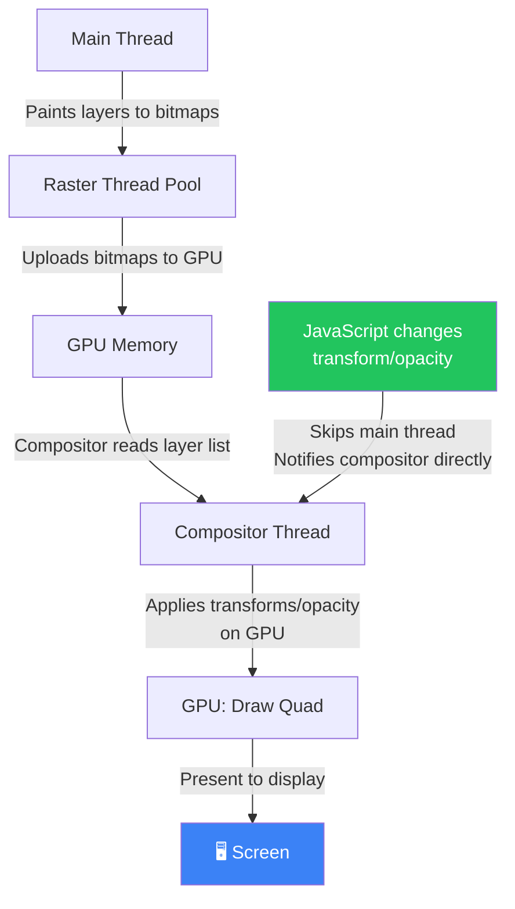
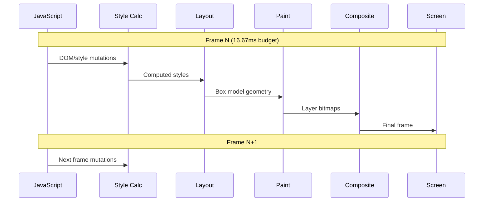

# 01 — The Browser Rendering Pipeline

> **"Every pixel on screen is the result of a pipeline. Understanding each stage is the difference between guessing at performance problems and knowing exactly where they are."**

This document covers the complete journey from raw HTML bytes to painted pixels — every stage, what triggers it, what skips it, and what it costs. This is the foundation of all frontend performance work.

---

## 📚 Table of Contents

1. [The Big Picture](#1-the-big-picture)
2. [Stage 1 — Navigation & Resource Loading](#2-stage-1--navigation--resource-loading)
3. [Stage 2 — Parsing HTML → DOM](#3-stage-2--parsing-html--dom)
4. [Stage 3 — Parsing CSS → CSSOM](#4-stage-3--parsing-css--cssom)
5. [Stage 4 — Building the Render Tree](#5-stage-4--building-the-render-tree)
6. [Stage 5 — Layout (Reflow)](#6-stage-5--layout-reflow)
7. [Stage 6 — Paint (Rasterization)](#7-stage-6--paint-rasterization)
8. [Stage 7 — Composite](#8-stage-7--composite)
9. [The 16ms Frame Budget](#9-the-16ms-frame-budget)
10. [What Triggers What — The Property Table](#10-what-triggers-what--the-property-table)
11. [Forced Synchronous Layout — Layout Thrashing](#11-forced-synchronous-layout--layout-thrashing)
12. [Good Practices](#12-good-practices)
13. [Bad Practices](#13-bad-practices)
14. [Reading a Flame Graph](#14-reading-a-flame-graph)
15. [Interview-Level Explanation](#15-interview-level-explanation)
16. [Exercises](#16-exercises)

---

## 1. The Big Picture

When a browser receives HTML from a server, it doesn't render it all at once. It runs it through a **multi-stage pipeline**, and each stage has a cost.

```
HTML bytes
    │
    ▼
┌─────────────────────────────────────────────────────────────────────┐
│                     BROWSER RENDERING PIPELINE                       │
│                                                                       │
│  ┌──────────┐   ┌──────────┐   ┌─────────────┐                      │
│  │  Parse   │   │  Parse   │   │   Render    │                      │
│  │   HTML   │   │   CSS    │   │    Tree     │                      │
│  │  → DOM   │   │ → CSSOM  │   │  (merged)   │                      │
│  └────┬─────┘   └────┬─────┘   └──────┬──────┘                      │
│       │              │                │                              │
│       └──────────────┘                │                              │
│              (both needed)            ▼                              │
│                              ┌────────────────┐                      │
│                              │     Layout     │ ← computes geometry  │
│                              │   (Reflow)     │   x, y, width, height│
│                              └───────┬────────┘                      │
│                                      │                              │
│                                      ▼                              │
│                              ┌────────────────┐                      │
│                              │     Paint      │ ← rasterizes pixels  │
│                              │  (Rasterize)   │   per layer          │
│                              └───────┬────────┘                      │
│                                      │                              │
│                                      ▼                              │
│                              ┌────────────────┐                      │
│                              │   Composite    │ ← GPU merges layers  │
│                              │   (GPU)        │   onto screen        │
│                              └───────┬────────┘                      │
│                                      │                              │
│                                      ▼                              │
│                                  🖥️ Screen                           │
└─────────────────────────────────────────────────────────────────────┘
```

**The critical insight:** Not every change goes through every stage. Changing `opacity` only triggers composite. Changing `color` triggers paint + composite. Changing `width` triggers layout + paint + composite. Knowing which stage a change triggers is the foundation of rendering performance.

---

## 2. Stage 1 — Navigation & Resource Loading

Before any rendering begins, the browser must get the resources.

### What happens when you navigate to a URL

```
User types URL
     │
     ▼
DNS Lookup  ──────────────────────────────── ~1–100ms
     │  (hostname → IP address)
     ▼
TCP Handshake ────────────────────────────── ~1 RTT
     │  (3-way handshake for connection)
     ▼
TLS Handshake (HTTPS) ───────────────────── ~1–2 RTTs
     │  (certificate exchange, cipher negotiation)
     ▼
HTTP Request ────────────────────────────── (depends on server)
     │  GET /index.html
     ▼
Server Response ─────────────────────────── (TTFB: time to first byte)
     │  HTML starts streaming
     ▼
Browser starts parsing ──────────────────── ← rendering pipeline begins
     │  (before the full HTML arrives)
```

**Key insight:** The browser starts parsing HTML **as it streams in**. It doesn't wait for the complete HTML file. This is called **incremental parsing** and it's why `<script>` tags at the bottom of `<body>` improve perceived performance.

### Resource Discovery & Preloading

As the parser encounters resources, it dispatches requests:

```html
<!-- Parser discovers these and dispatches requests -->
<link rel="stylesheet" href="styles.css" />
<!-- render-blocking -->
<script src="app.js"></script>
<!-- parser-blocking + render-blocking -->

<!-- non-blocking -->
<link rel="preload" href="font.woff2" as="font" />
<!-- preload hint -->
```

**The Preload Scanner:** While the main HTML parser is blocked by a `<script>`, a secondary **preload scanner** reads ahead in the HTML and dispatches resource requests early. This is a browser optimization — without it, a blocking script would prevent image and stylesheet downloads from starting.

---

## 3. Stage 2 — Parsing HTML → DOM

### The HTML Parser

The HTML parser converts raw bytes into a **Document Object Model (DOM)** — a tree of nodes representing the document's structure.

```
Bytes: 3C 68 74 6D 6C 3E...
         ↓
Characters: <html><head>...
         ↓
Tokens: StartTag:html, StartTag:head, ...
         ↓
Nodes: HTMLElement, HTMLHeadElement, ...
         ↓
DOM Tree:
         document
            └── html
                ├── head
                │   ├── title
                │   └── link (stylesheet)
                └── body
                    ├── header
                    │   └── h1 "Hello"
                    └── main
                        └── p "Content"
```

### What Blocks HTML Parsing

```html
<!-- ✅ Non-blocking — downloads in background -->


<!-- ❌ Parser-blocking — parsing STOPS until script downloads and executes -->
<script src="heavy-lib.js"></script>

<!-- ✅ Async — downloads in parallel, executes when ready (may still block render) -->
<script src="analytics.js" async></script>

<!-- ✅ Deferred — downloads in parallel, executes after HTML fully parsed -->
<script src="app.js" defer></script>

<!-- ❌ Render-blocking — browser won't display content until this loads -->
<link rel="stylesheet" href="styles.css" />
```

### Why CSS Blocks Parsing (Indirectly)

CSS itself doesn't block HTML parsing. But when the parser encounters a `<script>` tag _after_ a stylesheet, it stops and waits for the stylesheet to load before executing the script. Why? Because scripts can call `getComputedStyle()`, which requires the CSSOM to be ready.

```html
<link rel="stylesheet" href="slow-styles.css" />
<!-- starts downloading -->
<script>
  // Browser waits for slow-styles.css before running this
  // because getComputedStyle() needs CSSOM
  const color = getComputedStyle(document.body).color;
</script>
```

---

## 4. Stage 3 — Parsing CSS → CSSOM

While HTML is parsed into a DOM, CSS is parsed into a **CSS Object Model (CSSOM)** — a separate tree of style rules.

### CSSOM Structure

```css
body {
  font-size: 16px;
}
h1 {
  font-size: 2em;
  color: navy;
}
p {
  color: #333;
}
```

```
CSSOM:
body
  └── font-size: 16px
      ├── h1
      │   ├── font-size: 32px (2em × 16px, computed)
      │   └── color: navy
      └── p
          └── color: #333
```

### Why CSSOM Is Render-Blocking

The CSSOM **must** be complete before rendering can begin. The reason: CSS is cascading. A single rule at the bottom of a stylesheet can affect elements at the top. The browser can't safely render anything until it knows all the styles.

```
HTML parsing   ──────────────────────────────────────────▶
CSS parsing    ──────────────────▶ (CSSOM complete)
                                  │
Render Tree    ────────────────────────────────────────▶
                                  ↑
                        (waits for CSSOM)
```

**Implication:** Large CSS files delay time-to-first-render. This is why critical CSS inlining matters — putting above-the-fold styles in a `<style>` tag lets the browser start rendering without waiting for external stylesheets.

---

## 5. Stage 4 — Building the Render Tree

Once both the DOM and CSSOM are available, the browser merges them into a **Render Tree** (also called the Frame Tree in some engines).

### What's in the Render Tree

The Render Tree contains **only visible elements** with their computed styles attached:

```
DOM:                          CSSOM:
document                      body { font-size: 16px }
  └── html                    h1   { display: block; font-size: 2em }
      ├── head                span { display: none }  ← invisible
      │   └── title           p    { color: #333 }
      └── body
          ├── h1 "Title"
          ├── span "Hidden"   ← display:none
          └── p "Content"

              ↓ merge

Render Tree:
  body (font-size: 16px)
    ├── h1 (block, font-size: 32px)   "Title"
    └── p  (color: #333)              "Content"
    (span excluded — display:none)
```

**Key distinction:**

- `display: none` → **excluded** from render tree entirely (no box, no space)
- `visibility: hidden` → **included** in render tree (has a box, takes space, just invisible)
- `opacity: 0` → **included** in render tree (has a box, takes space, just transparent)

This distinction has profound performance implications (covered in Stage 7 — Composite).

---

## 6. Stage 5 — Layout (Reflow)

With the render tree built, the browser must calculate the **exact position and size** of every element. This stage is called **Layout** (or **Reflow**).

### What Layout Computes

```
Input: Render tree (elements + styles)
Output: Box model geometry for every element

For each element, layout computes:
  - x, y position in the document
  - width, height
  - margins, padding, borders
  - overflow boxes
  - line breaking for text
```

### Layout Is Expensive — And Cascading

Layout is one of the most expensive rendering operations because:

1. It's computed for the **entire document** by default
2. Changing one element can cascade and require re-layout of many others

```
┌──────────────────────────────────┐
│ Changing width of a parent       │
│         ↓                        │
│ Children must reflow (width %)   │
│         ↓                        │
│ Siblings may shift               │
│         ↓                        │
│ Absolutely positioned children   │
│ relative to this element reflow  │
└──────────────────────────────────┘
```

### What Triggers Layout (Reflow)

Any change that affects geometry — position, size, or relationship between elements:

```javascript
// Changes that ALWAYS trigger layout:
element.style.width = "200px"; // geometry change
element.style.height = "100px"; // geometry change
element.style.padding = "10px"; // geometry change
element.style.margin = "5px"; // geometry change
element.style.position = "absolute"; // affects flow
element.style.fontSize = "20px"; // affects text dimensions
element.style.display = "flex"; // new formatting context
document.body.appendChild(el); // DOM insertion
document.body.removeChild(el); // DOM removal
el.classList.add("big"); // if class changes geometry
```

### What READS Trigger Layout (Forced Synchronous Layout)

This is where most developers get surprised. **Reading certain properties forces the browser to perform layout immediately** — even mid-script:

```javascript
// These reads force synchronous layout:
element.offsetWidth; // forces layout
element.offsetHeight; // forces layout
element.offsetTop; // forces layout
element.offsetLeft; // forces layout
element.getBoundingClientRect(); // forces layout
element.scrollWidth; // forces layout
element.scrollHeight; // forces layout
element.clientWidth; // forces layout
element.clientHeight; // forces layout
window.getComputedStyle(el); // forces layout
```

Why? Because the browser batches layout work. It only computes layout when it needs to. But if you _read_ a geometry value, the browser must compute an up-to-date layout right now — even if you wrote a style change 3 lines ago that hasn't been laid out yet.

```javascript
// ❌ Layout thrashing: write → read → write → read
element.style.width = "100px"; // invalidates layout
const h = element.offsetHeight; // FORCED LAYOUT — browser must compute now
element.style.height = h + "px"; // invalidates layout again
const w = element.offsetWidth; // FORCED LAYOUT again
```

This pattern — alternating writes and reads — is called **layout thrashing** and is one of the most common performance killers in frontend code. Full deep-dive: [`performance/03-layout-thrashing.md`](../performance/03-layout-thrashing.md).

---

## 7. Stage 6 — Paint (Rasterization)

After layout, the browser knows where everything is. Now it must fill in the pixels. This stage is called **Paint** (or rasterization).

### What Paint Does

```
Input: Layout tree (positions + dimensions + styles)
Output: Pixel data per layer (bitmap/texture)

Paint fills in:
  - Background colors
  - Border colors and styles
  - Text (each glyph is rendered)
  - Box shadows
  - Outlines
  - Images
```

Paint happens **per layer** (more on layers in Composite). The browser rasterizes each layer into a bitmap.

### What Triggers Paint (But NOT Layout)

These CSS properties affect visual appearance but not geometry:

```javascript
// Triggers PAINT but not layout:
element.style.color = "red"; // text color
element.style.backgroundColor = "blue"; // background
element.style.backgroundImage = "..."; // background image
element.style.boxShadow = "..."; // shadow
element.style.border = "1px solid red"; // border color
element.style.outline = "..."; // outline
element.style.borderRadius = "8px"; // paint shape change
```

**Note:** `border-radius` is purely a paint concern — it doesn't change the box model geometry.

### Paint is Expensive Too

Paint involves rasterizing potentially thousands of pixels for complex elements:

- Shadows require multi-pass rendering
- Gradients are computed per-pixel
- Text requires font rasterization with anti-aliasing
- Large canvases require significant memory for bitmaps

---

## 8. Stage 7 — Composite

The final stage. The browser takes all the painted layers and composites them together — merging them into the final frame that gets sent to the screen.

This stage is handled by the browser's **compositor thread**, which is **separate from the main JavaScript thread**.

### Why Compositing Matters for Performance

If an animation only triggers composite (not layout or paint), it runs **entirely on the compositor thread** — bypassing JavaScript entirely. This means:

- The animation runs even if the main thread is busy (e.g., executing JavaScript)
- It runs at the display's native refresh rate
- It cannot be blocked by garbage collection pauses or heavy scripts

### What Only Triggers Composite

These are the "golden" CSS properties for animation:

```css
/* These ONLY trigger composite — no layout, no paint: */
transform: translateX(100px); /* position via GPU */
transform: scale(1.5); /* scale via GPU */
transform: rotate(45deg); /* rotation via GPU */
opacity: 0.5; /* transparency via GPU */
```

Why? The browser moves composite-only properties onto the GPU and handles them without touching the paint bitmap. The layer just gets moved/scaled/faded by the GPU.

### Layer Creation

Not every element gets its own compositor layer. Creating layers has a cost — memory, especially. The browser creates layers for:

```css
/* These cause layer promotion (explicitly or implicitly): */
will-change: transform; /* explicit promotion hint */
will-change: opacity; /* explicit promotion hint */
transform: translateZ(0); /* old hack — still works */
transform: translate3d(0, 0, 0); /* same hack */
position: fixed; /* always on own layer */
/* Video, canvas, WebGL always get their own layer */
```

### The Layer Explosion Problem

```css
/* ❌ Promotes EVERY list item to its own layer */
.list-item {
  will-change: transform; /* applied to 1000 items = 1000 GPU textures */
}

/* ✅ Only promote the item being animated */
.list-item.is-animating {
  will-change: transform;
}
```

Too many layers = GPU memory exhaustion + compositing overhead that outweighs the benefit.

### Full Composite-Stage Flow



---

## 9. The 16ms Frame Budget

At 60fps, the browser has **16.67ms** to complete a full frame. Here's how that budget is typically allocated:

```
16.67ms Frame Budget at 60fps
├── JavaScript execution          ~3–4ms  (your code + framework)
├── Style recalculation           ~0.5ms  (matching CSS rules to elements)
├── Layout                        ~2–3ms  (geometry computation)
├── Paint                         ~1–2ms  (rasterization)
├── Composite                     ~1ms    (GPU layer merge)
└── Browser overhead              ~2–3ms  (IPC, scheduling)

Total: ~10–13ms typical
Remaining margin: ~3–6ms
```

**If any stage exceeds its share, frames are dropped.** A dropped frame at 60fps means the display shows the same frame twice — perceptible as "jank."

```
Perfect 60fps:       |  |  |  |  |  |  |  |  | (frames every 16.67ms)
Long JavaScript:     |  |     |  |  |     |  |  (stuttering)
Long Layout:         |  |  |      |  |  |    |  (jank)
Compositor-only:     |  |  |  |  |  |  |  |  | (smooth, even if JS is busy)
```

### The Rendering Pipeline Per Frame



---

## 10. What Triggers What — The Property Table

This is the most practical reference in this document. Bookmark it.

### CSS Properties and Their Pipeline Cost

| Property                                   | Layout | Paint | Composite | Notes                   |
| ------------------------------------------ | :----: | :---: | :-------: | ----------------------- |
| `width`, `height`                          |   ✅   |  ✅   |    ✅     | Full pipeline           |
| `padding`, `margin`                        |   ✅   |  ✅   |    ✅     | Full pipeline           |
| `font-size`, `font-weight`                 |   ✅   |  ✅   |    ✅     | Text reflow             |
| `display`                                  |   ✅   |  ✅   |    ✅     | Formatting context      |
| `position`                                 |   ✅   |  ✅   |    ✅     | Document flow           |
| `top`, `left`, `right`, `bottom` (non-GPU) |   ✅   |  ✅   |    ✅     | Use `transform` instead |
| `color`                                    |   ❌   |  ✅   |    ✅     | Skip layout             |
| `background-color`                         |   ❌   |  ✅   |    ✅     | Skip layout             |
| `background-image`                         |   ❌   |  ✅   |    ✅     | Skip layout             |
| `box-shadow`                               |   ❌   |  ✅   |    ✅     | Expensive paint         |
| `border-radius`                            |   ❌   |  ✅   |    ✅     | Paint shape             |
| `outline`                                  |   ❌   |  ✅   |    ✅     | Skip layout             |
| `visibility`                               |   ❌   |  ✅   |    ✅     | Still takes space       |
| **`transform`**                            |   ❌   |  ❌   |    ✅     | **GPU only** ⭐         |
| **`opacity`**                              |   ❌   |  ❌   |    ✅     | **GPU only** ⭐         |
| **`filter` (GPU filters)**                 |   ❌   |  ❌   |    ✅     | GPU composited          |
| `cursor`                                   |   ❌   |  ❌   |    ❌     | No rendering            |
| `pointer-events`                           |   ❌   |  ❌   |    ❌     | No rendering            |

> ⭐ = Preferred for animations. These run on the compositor thread and cannot cause jank from JS.

---

## 11. Forced Synchronous Layout — Layout Thrashing

This deserves its own section because it's the most common rendering performance bug in production code.

### The Problem

Browsers batch layout work. They don't recompute layout on every style mutation — they wait until they need to. But certain **read operations** force an immediate layout computation, even if layout was invalidated moments before.

```javascript
// ❌ Classic layout thrashing — reads and writes alternating
const boxes = document.querySelectorAll(".box");

boxes.forEach((box) => {
  // WRITE: invalidates layout
  box.style.width = box.offsetWidth + 10 + "px";
  //                 ^^^^^^^^^^^^^^
  //                 READ: forces layout right NOW
  //                 (because previous write invalidated it)
});

// With 100 boxes: 100 forced layouts. Each one recalculates
// the entire document layout. This is catastrophic.
```

### The Fix — Separate Reads and Writes

```javascript
// ✅ Read ALL values first, then write ALL values
const boxes = document.querySelectorAll(".box");

// Phase 1: Read everything
const widths = Array.from(boxes).map((box) => box.offsetWidth);

// Phase 2: Write everything
// Layout is only invalidated once, computed once before next frame
boxes.forEach((box, i) => {
  box.style.width = widths[i] + 10 + "px";
});
```

### The FastDOM Pattern

For complex cases, use the FastDOM batching pattern:

```javascript
// Micro-library pattern for automatic read/write batching
const fastDOM = {
  reads: [],
  writes: [],
  scheduled: false,

  measure(fn) {
    this.reads.push(fn);
    this._schedule();
  },

  mutate(fn) {
    this.writes.push(fn);
    this._schedule();
  },

  _schedule() {
    if (this.scheduled) return;
    this.scheduled = true;
    requestAnimationFrame(() => this._flush());
  },

  _flush() {
    // All reads first
    const reads = this.reads.splice(0);
    reads.forEach((fn) => fn());

    // Then all writes
    const writes = this.writes.splice(0);
    writes.forEach((fn) => fn());

    this.scheduled = false;

    // If more work was queued during flush, schedule again
    if (this.reads.length || this.writes.length) {
      this._schedule();
    }
  },
};

// Usage:
fastDOM.measure(() => {
  const width = box.offsetWidth; // safe read
  fastDOM.mutate(() => {
    box.style.width = width + 10 + "px"; // safe write
  });
});
```

---

## 12. Good Practices

### ✅ Animate only `transform` and `opacity`

```css
/* ✅ Composite-only — smooth, no layout/paint */
.card {
  transition:
    transform 300ms ease,
    opacity 300ms ease;
}

.card:hover {
  transform: translateY(-4px) scale(1.02);
  opacity: 0.95;
}

/* ❌ Triggers layout — causes jank on low-end devices */
.card:hover {
  top: -4px; /* triggers layout */
  width: 102%; /* triggers layout */
}
```

### ✅ Use `will-change` surgically

```css
/* ✅ Only on elements that WILL animate */
.modal {
  /* Don't apply until animation starts */
}

.modal.is-opening {
  will-change: transform, opacity; /* promote to GPU layer */
}

/* Remove after animation */
.modal.is-open {
  will-change: auto; /* release GPU memory */
}
```

### ✅ Batch DOM reads and writes

```javascript
// ✅ Read phase, then write phase
const measurements = elements.map((el) => el.getBoundingClientRect());
elements.forEach((el, i) => {
  el.style.transform = `translateX(${measurements[i].width}px)`;
});
```

### ✅ Use DocumentFragment for batch insertions

```javascript
// ✅ One reflow, not N reflows
const fragment = document.createDocumentFragment();
items.forEach((item) => {
  const el = document.createElement("div");
  el.textContent = item;
  fragment.appendChild(el); // no reflow, fragment is off-screen
});
container.appendChild(fragment); // ONE reflow
```

### ✅ Use CSS containment to limit reflow scope

```css
/* Tells the browser: changes inside this element
   cannot affect elements outside it */
.widget {
  contain: layout; /* isolate layout */
  contain: paint; /* isolate painting */
  contain: strict; /* contain: layout paint size */
}
```

---

## 13. Bad Practices

### ❌ Animating layout-triggering properties

```css
/* ❌ Every frame: layout → paint → composite */
@keyframes slide {
  from {
    left: -100px;
  } /* triggers layout */
  to {
    left: 0;
  } /* triggers layout */
}

/* ✅ Every frame: composite only */
@keyframes slide {
  from {
    transform: translateX(-100px);
  }
  to {
    transform: translateX(0);
  }
}
```

### ❌ Reading layout properties in loops

```javascript
// ❌ Forces layout on every iteration
items.forEach((item) => {
  if (item.offsetHeight > 100) {
    // forced layout every iteration
    item.classList.add("tall");
  }
});
```

### ❌ Applying `will-change` to everything

```css
/* ❌ Promotes every element to GPU layer — massive memory use */
* {
  will-change: transform;
}
```

### ❌ Deeply nested DOM causing cascading reflow

```html
<!-- ❌ Changing any ancestor width triggers reflow of all descendants -->
<div class="outer">
  <!-- 1000px wide -->
  <div class="inner">
    <!-- 50% = 500px -->
    <div class="content">
      <!-- needs re-layout -->
      <!-- 50 more levels deep... -->
    </div>
  </div>
</div>
```

---

## 14. Reading a Flame Graph

The Chrome DevTools Performance tab visualizes the rendering pipeline as a flame graph. Understanding it is essential for debugging real performance problems.

```
Performance Tab — Main Thread Timeline:

Time →  0ms    16ms    32ms    48ms    64ms
        │       │       │       │       │
Task    ████████████████░░░░░░░░░░░░░░░░  ← long task (> 50ms = bad)
        │
        └── Parse HTML          ████
        └── Evaluate Script     ██████████
             └── (your code)    ██████
        └── Layout              ████
        └── Pre-Paint           ██
        └── Paint               ████████
        └── Composite           ██

Color coding:
  Blue   = HTML parsing, network
  Yellow = JavaScript execution
  Purple = Style recalculation, Layout
  Green  = Paint
  Gray   = Composite, other
```

### How to Read It

1. **Look for long tasks (red triangle in corner)** — any task > 50ms is flagged
2. **Find the widest yellow bar** — that's your JavaScript bottleneck
3. **Find purple bars right after yellow** — layout triggered by your JS
4. **Check for repeated purple/green** — layout thrashing (many paint/layout cycles)
5. **Dropped frames** show as gaps in the frame timeline at the top

### Opening the Right DevTools Views

```
For rendering pipeline analysis:
1. Open DevTools (F12)
2. Performance tab → Record
3. Interact with your page
4. Stop recording
5. Look at:
   - Frame timeline (top): dropped frames = red
   - Main thread (middle): flame graph
   - Bottom panel: Summary pie chart of time per stage

For paint checking:
1. DevTools → Three dots → More tools → Rendering
2. Enable "Paint flashing" — green overlay shows what's being repainted
3. Enable "Layer borders" — orange = layer borders, blue = compositor tiles

For layout checking:
1. Same Rendering panel
2. Enable "Layout Shift Regions" — shows elements causing CLS
```

---

## 15. Interview-Level Explanation

> **Question: "Walk me through the browser rendering pipeline."**

**Strong answer:**

> "When the browser receives HTML, it starts parsing it into a DOM tree incrementally — it doesn't wait for the full response. Simultaneously, it parses any CSS into a CSSOM. CSS is render-blocking because the browser can't safely display anything until it knows all the styles — a single CSS rule could affect anything.
>
> Once both are ready, it builds the Render Tree — a merged structure that only includes visible elements with their computed styles attached. `display: none` elements are excluded entirely.
>
> Then comes Layout, where the browser computes the exact position and size of every element. This is expensive and cascading — changing one element's width can force a reflow of all its children.
>
> Paint follows, where the browser rasterizes each layer into pixel bitmaps — filling in colors, text, shadows, borders.
>
> Finally, Composite, where the GPU merges all the painted layers into the final frame. The key insight here is that `transform` and `opacity` only trigger composite — they run entirely on the compositor thread, separate from JavaScript. That's why they're preferred for animations.
>
> For performance, the goal is to avoid triggering layout at all during animations — and to batch DOM reads and writes to prevent layout thrashing, which is what happens when you alternate reads and writes and force the browser to recompute layout repeatedly in a single frame."

---

## 16. Exercises

### Exercise 1 — Identify the pipeline stage

For each CSS change, state which stages are triggered:

```css
a) element.style.width = '200px';
b) element.style.color = 'red';
c) element.style.transform = 'translateX(50px)';
d) element.style.opacity = '0.5';
e) element.style.boxShadow = '0 2px 4px rgba(0,0,0,0.2)';
f) element.style.display = 'none';
```

<details>
<summary>Answers</summary>

```
a) width       → Layout + Paint + Composite
b) color       → Paint + Composite (no layout)
c) transform   → Composite only ⭐
d) opacity     → Composite only ⭐
e) box-shadow  → Paint + Composite (no layout)
f) display:none → Layout + Paint + Composite (removes from render tree)
```

</details>

---

### Exercise 2 — Find and fix layout thrashing

```javascript
// ❌ This causes layout thrashing. Find where and fix it.
function resizeToFitContent(panels) {
  panels.forEach((panel) => {
    const content = panel.querySelector(".content");
    const headerHeight = panel.querySelector(".header").offsetHeight;
    const footerHeight = panel.querySelector(".footer").offsetHeight;
    const totalHeight = panel.offsetHeight;
    content.style.height = totalHeight - headerHeight - footerHeight + "px";
  });
}
```

<details>
<summary>Solution</summary>

```javascript
// ✅ Separate all reads, then all writes
function resizeToFitContent(panels) {
  // Phase 1: Read ALL measurements
  const measurements = panels.map((panel) => ({
    headerHeight: panel.querySelector(".header").offsetHeight,
    footerHeight: panel.querySelector(".footer").offsetHeight,
    totalHeight: panel.offsetHeight,
    content: panel.querySelector(".content"),
  }));

  // Phase 2: Write ALL changes
  measurements.forEach(
    ({ headerHeight, footerHeight, totalHeight, content }) => {
      content.style.height = totalHeight - headerHeight - footerHeight + "px";
    },
  );
}
```

</details>

---

### Exercise 3 — Profile a page

1. Open Chrome DevTools → Performance tab
2. Open any JavaScript-heavy website (e.g., a news site with infinite scroll)
3. Hit Record, scroll for 5 seconds, stop
4. Find:
   - The longest task on the main thread
   - Whether any frames were dropped
   - Whether paint flashing shows unnecessary repaints
   - The biggest contributor to layout time

Write down your findings and what you'd investigate first.

---

## 🔗 Related Topics

- [`browser-internals/04-layout-reflow.md`](./04-layout-reflow.md) — Layout deep dive
- [`browser-internals/05-paint-repaint.md`](./05-paint-repaint.md) — Paint deep dive
- [`browser-internals/06-composite-layers.md`](./06-composite-layers.md) — Layer system deep dive
- [`performance/03-layout-thrashing.md`](../performance/03-layout-thrashing.md) — Full thrashing guide
- [`rendering/01-dom-batching.md`](../rendering/01-dom-batching.md) — Batching patterns
- [`debugging/01-performance-tab.md`](../debugging/01-performance-tab.md) — DevTools mastery

---

<div align="center">

**Next:** [`browser-internals/04-layout-reflow.md`](./04-layout-reflow.md) →

</div>
