# Architecture Diagrams

> **"A diagram earns its place when it communicates in two seconds what would take two paragraphs to write. These are the diagrams worth having on a reference card: the browser rendering pipeline, React's lifecycle, the event loop, request flows, and architectural patterns."**

All diagrams are written in Mermaid and render natively in GitHub, GitLab, Notion, Obsidian, and most modern markdown viewers.

---

## Browser Rendering Pipeline

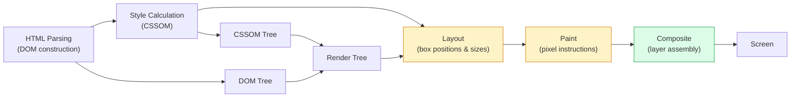

---

## CSS Property Animation Cost

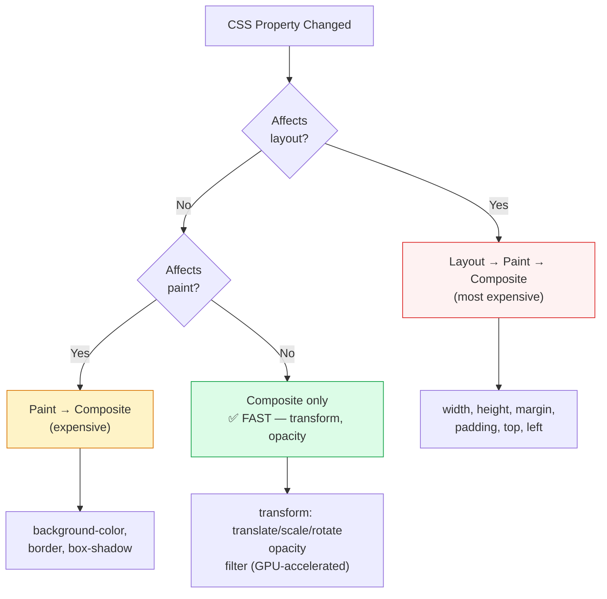

---

## The JavaScript Event Loop

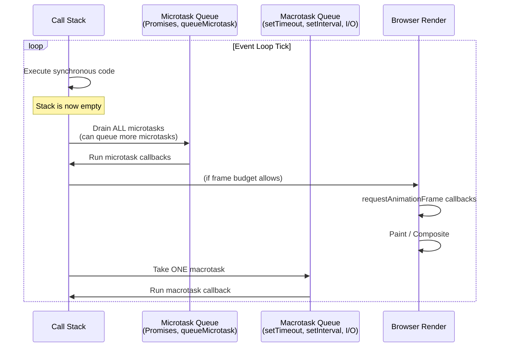

---

## React Component Lifecycle (Function Component)

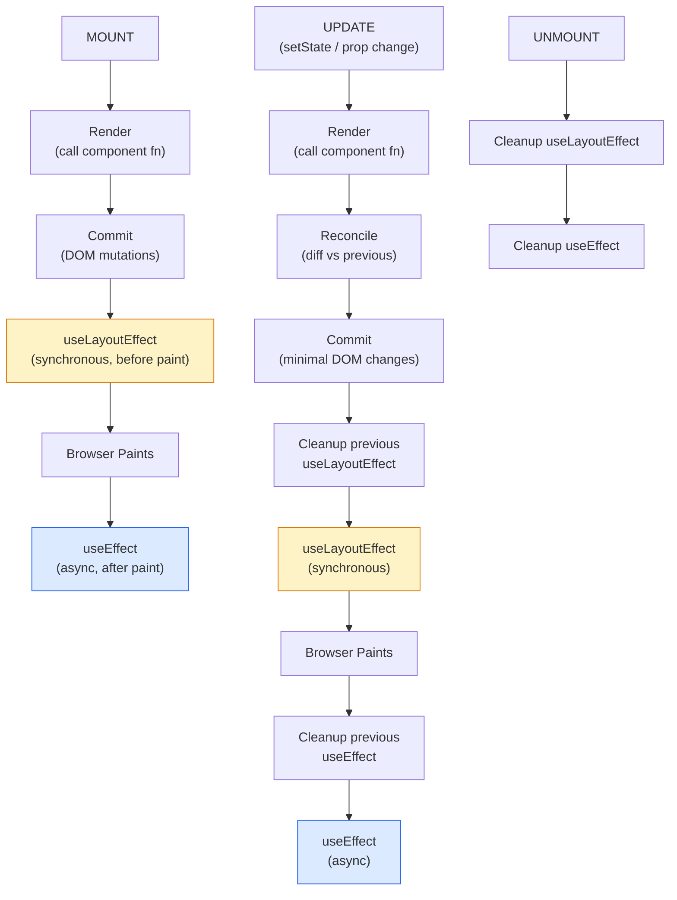

---

## React Rendering Decision Tree

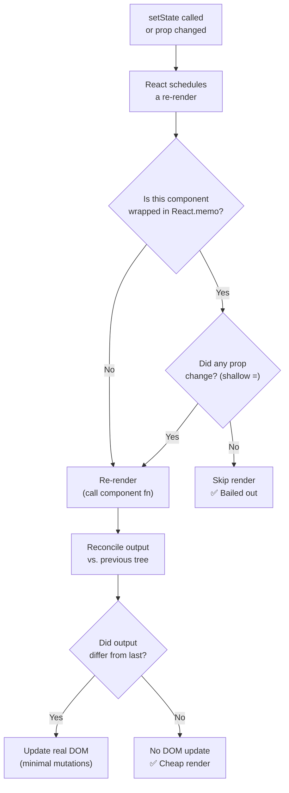

---

## Token Storage Security Model

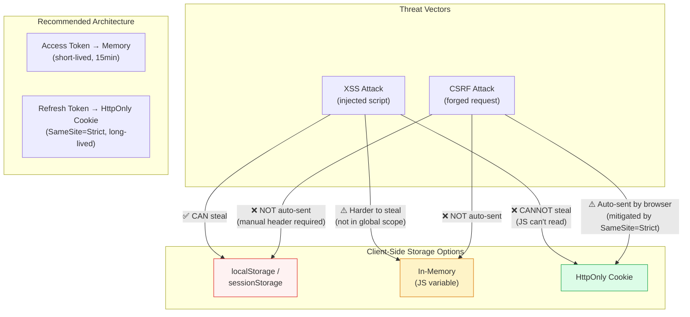

---

## OAuth 2.0 PKCE Flow (SPA)

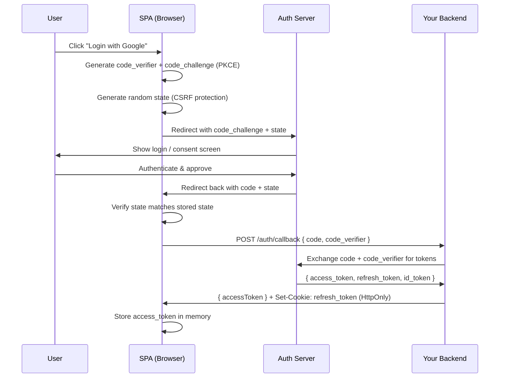

---

## HTTP Request Waterfall vs Parallel

```mermaid
gantt
  title Sequential vs Parallel Requests
  dateFormat X
  axisFormat %Lms

  section Sequential (Bad)
  Request 1 : 0, 200
  Request 2 : 200, 400
  Request 3 : 400, 600
  Total (600ms) : milestone, 600, 600

  section Parallel (Good)
  Request 1 : 0, 200
  Request 2 : 0, 300
  Request 3 : 0, 250
  Total (300ms) : milestone, 300, 300
```

---

## State Management Decision Tree

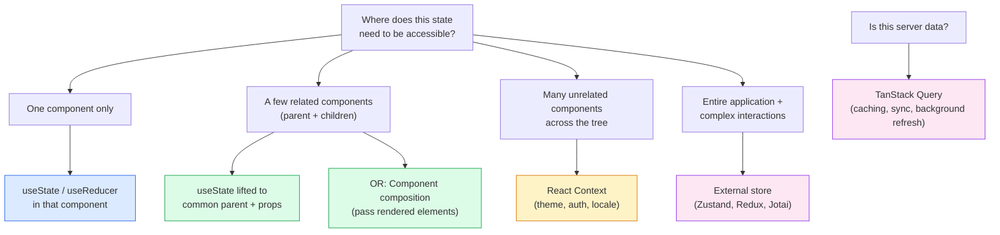

---

## Micro-Frontend Architecture

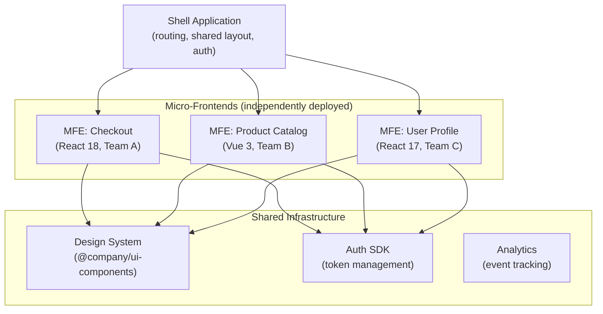

---

## Service Worker Cache Strategies

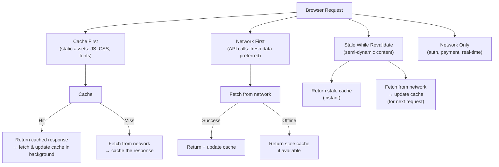

---

## React Concurrent Rendering

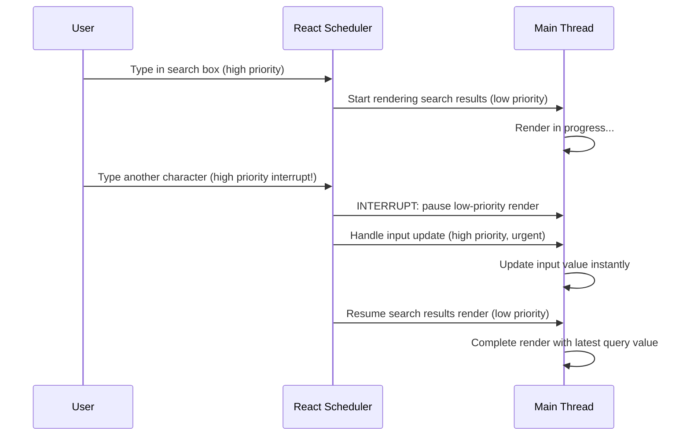

---

## WebSocket Connection Lifecycle

```mermaid
stateDiagram-v2
  [*] --> Connecting: connect() called
  Connecting --> Open: WebSocket handshake successful
  Connecting --> Closed: Connection refused / network error
  Open --> Closed: ws.close() or network drop
  Closed --> Reconnecting: Auto-reconnect scheduled\n(exponential backoff)
  Reconnecting --> Connecting: Reconnect attempt
  Open --> Open: Messages flowing\n(onmessage / send)

  note right of Reconnecting: Attempt 1: 1s delay\nAttempt 2: 2s delay\nAttempt 3: 4s delay\nMax: 30s delay
```

---

## Virtualized List — What the Browser Actually Sees

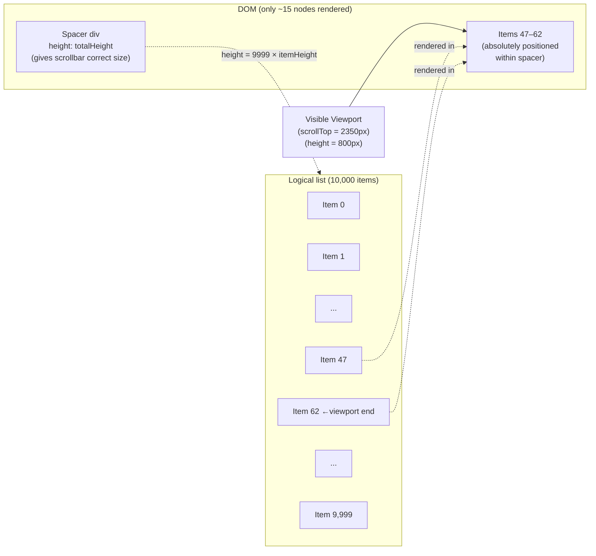

---

## Error Boundary Placement Strategy

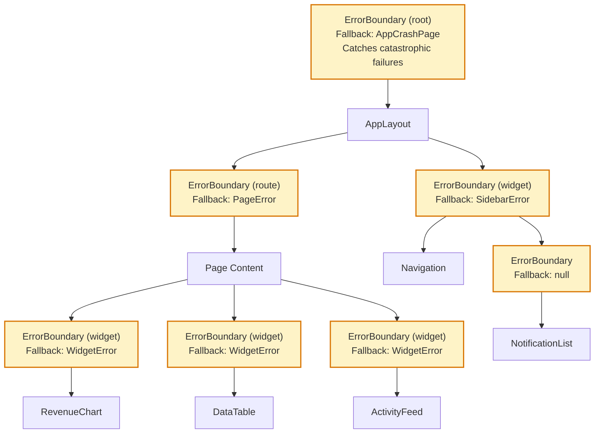

---

## Core Web Vitals — What They Measure

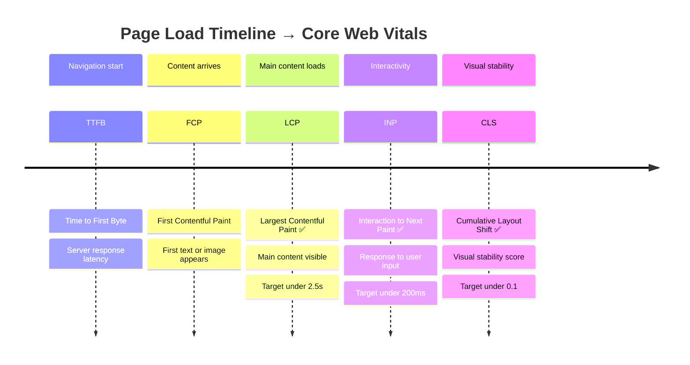
