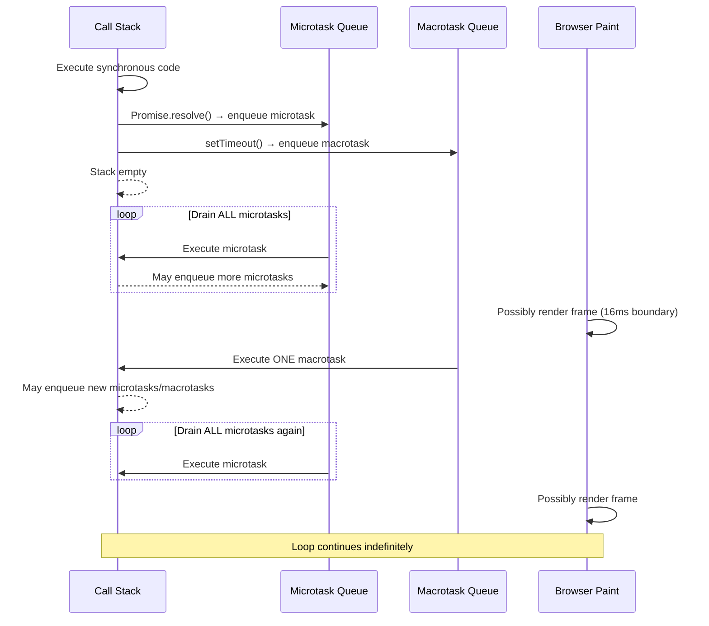

# 03 — The Event Loop

> **"JavaScript is single-threaded. The event loop is how it pretends not to be."**

Understanding the event loop at a deep level is what separates engineers who debug async bugs quickly from those who spend hours confused. This document covers not just _what_ the event loop is, but _how_ the V8 engine and browser work together to execute your code — and exactly what that means for your production applications.

---

## 📚 Table of Contents

1. [The Mental Model](#1-the-mental-model)
2. [Components of the Concurrency Model](#2-components-of-the-concurrency-model)
3. [The Call Stack — Deep Dive](#3-the-call-stack--deep-dive)
4. [The Task Queues](#4-the-task-queues)
5. [Microtasks vs Macrotasks — The Critical Distinction](#5-microtasks-vs-macrotasks--the-critical-distinction)
6. [The Event Loop Algorithm](#6-the-event-loop-algorithm)
7. [Visual Execution Traces](#7-visual-execution-traces)
8. [Real-World Implications](#8-real-world-implications)
9. [Good Practices](#9-good-practices)
10. [Bad Practices](#10-bad-practices)
11. [Common Mistakes](#11-common-mistakes)
12. [Performance Implications](#12-performance-implications)
13. [Interview-Level Explanation](#13-interview-level-explanation)
14. [Exercises](#14-exercises)

---

## 1. The Mental Model

Before code, build the right mental model.

JavaScript runs in a single thread. That means only **one thing executes at a time** on the main thread. There is no true parallelism in your JavaScript code (Web Workers are a separate thread — covered later).

But clearly, JavaScript _can_ handle:

- Timers (`setTimeout`, `setInterval`)
- Network requests (`fetch`)
- User events (clicks, keypresses)
- Animations (`requestAnimationFrame`)

How? Not by running them concurrently — by **deferring** them.

The event loop is the mechanism that decides: _"The call stack is empty. What should I run next?"_

```
┌─────────────────────────────────────────────────────────────┐
│                        BROWSER / NODE                        │
│                                                              │
│   ┌─────────────┐     ┌─────────────────────────────────┐   │
│   │  JavaScript │     │         Web APIs / C++          │   │
│   │   Engine    │────▶│  setTimeout, fetch, DOM events  │   │
│   │   (V8)      │     │  setInterval, requestAnimFrame  │   │
│   └──────┬──────┘     └────────────────┬────────────────┘   │
│          │                             │                      │
│   ┌──────▼──────┐                      │ (callbacks          │
│   │ Call Stack  │                      │  queued when done)  │
│   │             │◀─────────────────────┤                     │
│   └──────┬──────┘     ┌────────────────▼────────────────┐   │
│          │            │           Task Queues            │   │
│          │            │  ┌────────────────────────────┐  │   │
│          │            │  │  Microtask Queue           │  │   │
│          │            │  │  (Promise, queueMicrotask) │  │   │
│          │            │  └────────────────────────────┘  │   │
│          │            │  ┌────────────────────────────┐  │   │
│          │            │  │  Macrotask Queue           │  │   │
│          │            │  │  (setTimeout, setInterval, │  │   │
│          │            │  │   I/O, UI events)          │  │   │
│          │            │  └────────────────────────────┘  │   │
│          │            └────────────────────────────────┘  │   │
│          │                                                  │
│   ┌──────▼──────────────────────────────────────────────┐  │
│   │                    EVENT LOOP                        │  │
│   │  "Is the call stack empty?                           │  │
│   │   Yes → drain microtask queue → run 1 macrotask"    │  │
│   └──────────────────────────────────────────────────────┘  │
└─────────────────────────────────────────────────────────────┘
```

---

## 2. Components of the Concurrency Model

### 2.1 The JavaScript Engine (V8)

V8 is Google's JavaScript engine used in Chrome and Node.js. It:

- **Parses** your JavaScript source
- **Compiles** it to machine code (JIT compilation)
- **Executes** it on the main thread
- **Manages the call stack** and heap memory

V8 itself has no concept of `setTimeout` or `fetch`. Those are provided by the **host environment** (browser or Node.js).

### 2.2 The Host Environment

The browser (or Node.js) provides:

| API                          | What it does              | Where it runs             |
| ---------------------------- | ------------------------- | ------------------------- |
| `setTimeout` / `setInterval` | Schedules timer callbacks | Browser timer thread      |
| `fetch` / `XMLHttpRequest`   | Network requests          | Browser networking thread |
| DOM events                   | User interactions         | Browser I/O thread        |
| `requestAnimationFrame`      | Pre-paint callbacks       | Browser compositor thread |
| `requestIdleCallback`        | Idle-time callbacks       | Browser scheduler         |

These APIs run **off the main thread**. When they complete, they push a **callback** into a task queue.

### 2.3 The Heap

Where objects are allocated in memory. When you write `const obj = {}`, that object lives in the heap. The call stack holds a _reference_ to it.

### 2.4 The Call Stack

Where function execution contexts live. LIFO (Last In, First Out). When a function is called, a frame is pushed. When it returns, the frame is popped.

### 2.5 The Task Queues

Two main queues (explained in detail below):

- **Microtask queue** — high priority, drains completely before anything else
- **Macrotask queue** — one task per event loop iteration

---

## 3. The Call Stack — Deep Dive

Every time a function is called, an **execution context** is created and pushed to the call stack.

```javascript
function greet(name) {
  const message = buildMessage(name); // calls buildMessage
  console.log(message);
}

function buildMessage(name) {
  return `Hello, ${name}!`; // returns, frame popped
}

greet("Alice"); // entry point
```

**Stack trace, step by step:**

```
Step 1: greet('Alice') called
┌─────────────────┐
│ greet           │  ← top of stack
│ (anonymous)     │  ← global execution context
└─────────────────┘

Step 2: greet calls buildMessage
┌─────────────────┐
│ buildMessage    │  ← top of stack
│ greet           │
│ (anonymous)     │
└─────────────────┘

Step 3: buildMessage returns
┌─────────────────┐
│ greet           │  ← back to greet
│ (anonymous)     │
└─────────────────┘

Step 4: greet returns
┌─────────────────┐
│ (anonymous)     │  ← back to global
└─────────────────┘

Step 5: Script finishes
(empty)
```

### Stack Overflow

When the call stack exceeds its size limit, you get a `Maximum call stack size exceeded` error:

```javascript
// ❌ Infinite recursion — stack overflow
function infinite() {
  return infinite(); // no base case
}
infinite(); // RangeError: Maximum call stack size exceeded
```

The call stack is **finite**. This is why deeply recursive algorithms can crash your program.

---

## 4. The Task Queues

### 4.1 The Microtask Queue

**What goes here:**

- `Promise` `.then()`, `.catch()`, `.finally()` callbacks
- `async/await` continuations (they desugar to Promises)
- `queueMicrotask()` callbacks
- `MutationObserver` callbacks

**Key behavior:** The microtask queue is **completely drained** before the browser renders a frame or runs any macrotask. Every microtask queued _during_ a microtask flush is also processed before the queue is considered empty.

```javascript
Promise.resolve().then(() => {
  console.log("microtask 1");
  // Queuing another microtask from within a microtask
  Promise.resolve().then(() => console.log("microtask 2"));
});

// Output:
// microtask 1
// microtask 2  ← runs before ANY macrotask
```

> ⚠️ **Danger:** An infinite chain of microtasks will **starve** the event loop. The browser will never render, never process user input. This is a real production bug.

### 4.2 The Macrotask Queue (Task Queue)

**What goes here:**

- `setTimeout` callbacks (even `setTimeout(fn, 0)`)
- `setInterval` callbacks
- `MessageChannel` callbacks
- I/O callbacks (file read complete, network response)
- DOM event callbacks (click, keydown, etc.)
- `setImmediate` (Node.js only)

**Key behavior:** The event loop processes **one macrotask** per iteration, then drains the entire microtask queue before proceeding to the next macrotask.

### 4.3 The Animation Frame Queue

`requestAnimationFrame` callbacks are neither microtasks nor macrotasks. They run:

- After the current macrotask
- After microtasks are drained
- **Before the browser paints the frame**

This makes RAF ideal for visual updates — you're guaranteed to run before the pixels are committed to screen.

### 4.4 The Idle Callback Queue

`requestIdleCallback` callbacks run during **idle periods** — when the browser has spare time after handling input, rendering, and scheduled tasks.

```
Frame budget: 16.67ms (60fps)
├── Input handling
├── JavaScript (your macrotask)
├── Microtask queue drain
├── requestAnimationFrame callbacks
├── Layout
├── Paint
├── Composite
└── Idle time → requestIdleCallback runs here
```

---

## 5. Microtasks vs Macrotasks — The Critical Distinction

This is the source of most async confusion in JavaScript.

### The Rule (memorize this)

```
After each macrotask:
  → Drain the ENTIRE microtask queue
  → (browser may render a frame here)
  → Run the next macrotask
  → Repeat
```

### Visual Comparison



### Concrete Example — Predict the Output

```javascript
console.log("1"); // sync

setTimeout(() => console.log("2"), 0); // macrotask

Promise.resolve()
  .then(() => console.log("3")) // microtask
  .then(() => console.log("4")); // microtask (chained)

console.log("5"); // sync
```

**Before running:** What do you predict?

```
Execution trace:
─────────────────────────────────────────────────
① console.log('1')       → SYNC       → prints: 1
② setTimeout(fn, 0)      → schedules macrotask
③ Promise.resolve()      → schedules microtask (then → '3')
④ console.log('5')       → SYNC       → prints: 5
─────────────────────────────────────────────────
Call stack empty. Event loop checks microtask queue:
⑤ microtask: console.log('3')          → prints: 3
   → .then(() => '4') enqueued as new microtask
⑥ microtask: console.log('4')          → prints: 4
   Microtask queue empty.
─────────────────────────────────────────────────
Event loop checks macrotask queue:
⑦ macrotask: console.log('2')          → prints: 2
─────────────────────────────────────────────────
Output: 1, 5, 3, 4, 2
```

### Why `setTimeout(fn, 0)` Isn't Instant

People think `setTimeout(fn, 0)` runs "immediately after the current code." It doesn't. It runs:

1. After **all** synchronous code
2. After **all** microtasks
3. As the next macrotask

It's the _lowest priority_ callback mechanism available.

---

## 6. The Event Loop Algorithm

Here is the actual algorithm the browser runs, simplified:

```
loop forever:
  1. Dequeue and execute the oldest task from the macrotask queue
     (or execute the global script on first run)

  2. Drain the microtask queue:
     while microtask queue is not empty:
       dequeue microtask
       execute it
       (if it enqueues more microtasks, those run too — before moving on)

  3. If a rendering opportunity exists (≥ 16.67ms since last paint):
     a. Run requestAnimationFrame callbacks
     b. Perform layout (reflow)
     c. Perform paint
     d. Composite and present frame

  4. If idle time remains:
     a. Run requestIdleCallback callbacks

  5. Go to step 1
```

**The key insight:** The browser can only render a new frame **between macrotasks**. If your macrotask takes 500ms to run, the browser is locked — no user input, no painting, no animations. The UI is frozen.

---

## 7. Visual Execution Traces

### Trace 1 — async/await desugaring

```javascript
async function fetchData() {
  console.log("A");
  const result = await Promise.resolve("data");
  console.log("B", result); // everything after await is a microtask
  return result;
}

console.log("1");
fetchData();
console.log("2");
```

`async/await` desugars to:

```javascript
// Equivalent behavior:
function fetchData() {
  console.log("A");
  return Promise.resolve("data").then((result) => {
    console.log("B", result);
    return result;
  });
}
```

```
Execution trace:
① '1'      → sync
② fetchData() called:
    → 'A'  → sync (inside fetchData)
    → hits `await` → suspends fetchData, enqueues microtask
③ '2'      → sync (continues after fetchData suspension)
Call stack empty:
④ microtask: resume fetchData → 'B data'
─────────────────────────────────────────────────
Output: 1, A, 2, B data
```

### Trace 2 — Multiple Promise chains

```javascript
Promise.resolve()
  .then(() => {
    console.log("p1-1");
    return Promise.resolve(); // creates a NEW promise
  })
  .then(() => console.log("p1-2")); // delayed by 2 microtask ticks

Promise.resolve()
  .then(() => console.log("p2-1"))
  .then(() => console.log("p2-2"));
```

```
Microtask queue state, step by step:
Initial: [p1-1 handler, p2-1 handler]

Run p1-1 → logs 'p1-1', returns Promise.resolve()
  → p1-2 handler must wait for returned promise to resolve
  → that itself takes 2 more microtask ticks (PromiseResolveThenableJob)
Queue: [p2-1 handler, PromiseResolveThenableJob]

Run p2-1 → logs 'p2-1'
Queue: [PromiseResolveThenableJob, p2-2 handler]

Run PromiseResolveThenableJob (resolves the returned promise)
Queue: [p2-2 handler, p1-2 handler]

Run p2-2 → logs 'p2-2'
Run p1-2 → logs 'p1-2'

Output: p1-1, p2-1, p2-2, p1-2
```

> This is a notorious interview question. The key: returning `Promise.resolve()` from a `.then()` adds **two extra microtask ticks** due to the `PromiseResolveThenableJob` in the spec.

---

## 8. Real-World Implications

### 8.1 UI Freezing

```javascript
// ❌ This freezes the UI for the entire loop duration
function processLargeDataset(data) {
  // If data has 100,000 items and each iteration takes 0.1ms
  // Total: 10 seconds of frozen UI
  for (let i = 0; i < data.length; i++) {
    heavyOperation(data[i]);
  }
}
```

The browser **cannot render, cannot handle clicks, cannot run animations** while this synchronous loop runs. It's one giant macrotask.

**Fix:** Chunk the work using `setTimeout` or `requestIdleCallback`:

```javascript
// ✅ Yields back to the event loop between chunks
function processLargeDataset(data, onComplete) {
  const CHUNK_SIZE = 500;
  let index = 0;

  function processChunk() {
    const end = Math.min(index + CHUNK_SIZE, data.length);

    for (; index < end; index++) {
      heavyOperation(data[i]);
    }

    if (index < data.length) {
      // Yield to the event loop — browser can render/handle input
      setTimeout(processChunk, 0); // schedules as macrotask
    } else {
      onComplete();
    }
  }

  processChunk();
}
```

### 8.2 Microtask Starvation

```javascript
// ❌ Infinite microtask loop — NEVER use this
// The browser can NEVER render because microtasks never drain
function infiniteMicrotasks() {
  Promise.resolve().then(infiniteMicrotasks);
}
infiniteMicrotasks();
```

This is catastrophic. The page freezes forever. Microtask starvation is real and subtle — a Promise chain that recursively creates more promises will exhibit the same behavior.

### 8.3 Event Handler Timing

```javascript
// Understanding why this matters in practice
button.addEventListener("click", () => {
  // This entire function is ONE macrotask
  // The browser won't repaint until this returns

  updateUI(); // DOM mutations happen here
  // But user won't SEE the update until after this function + microtasks complete
  // and the browser gets a render opportunity
});
```

### 8.4 `queueMicrotask` for Libraries

Library authors use `queueMicrotask` to defer work without the overhead of creating a Promise:

```javascript
// Batching DOM updates — collect during sync code, flush in microtask
class UpdateBatcher {
  constructor() {
    this.pending = new Set();
    this.scheduled = false;
  }

  schedule(component) {
    this.pending.add(component);
    if (!this.scheduled) {
      this.scheduled = true;
      // Flush after all synchronous code in current task
      queueMicrotask(() => this.flush());
    }
  }

  flush() {
    for (const component of this.pending) {
      component.render();
    }
    this.pending.clear();
    this.scheduled = false;
  }
}
```

---

## 9. Good Practices

### ✅ Use `queueMicrotask` for high-priority deferred work

```javascript
// When you need something to run asap, but after current synchronous code
function scheduleHighPriority(fn) {
  queueMicrotask(fn);
}
```

### ✅ Use `setTimeout(fn, 0)` to yield the main thread

```javascript
// Gives the browser a chance to render/handle input between chunks
function yieldToMain() {
  return new Promise((resolve) => setTimeout(resolve, 0));
}

async function processWithYield(items) {
  for (let i = 0; i < items.length; i++) {
    process(items[i]);
    // Yield every 50 items
    if (i % 50 === 0) await yieldToMain();
  }
}
```

### ✅ Use `requestAnimationFrame` for visual updates

```javascript
// ✅ Runs before the browser paints — no missed frames
function updateAnimation(timestamp) {
  element.style.transform = `translateX(${getPosition(timestamp)}px)`;
  requestAnimationFrame(updateAnimation);
}
requestAnimationFrame(updateAnimation);
```

### ✅ Use `requestIdleCallback` for non-urgent background work

```javascript
// Analytics, prefetching, cleanup — things that can wait
requestIdleCallback((deadline) => {
  while (deadline.timeRemaining() > 0 && tasks.length > 0) {
    processNextTask(tasks.shift());
  }
  // If tasks remain, schedule another idle callback
  if (tasks.length > 0) {
    requestIdleCallback(processTasks);
  }
});
```

### ✅ Never block the event loop with synchronous I/O or heavy computation

```javascript
// ✅ Parse JSON in a Web Worker if it's a large payload
const worker = new Worker("json-parser.js");
worker.postMessage(largeRawData);
worker.onmessage = (e) => {
  renderData(e.data); // back on main thread with parsed result
};
```

---

## 10. Bad Practices

### ❌ Long synchronous loops on the main thread

```javascript
// ❌ Freezes UI for seconds
function sortAndRender(million_items) {
  const sorted = million_items.sort((a, b) => a - b); // blocks
  render(sorted); // can't even start until sort is done
}
```

### ❌ Infinite or deeply recursive microtask chains

```javascript
// ❌ Microtask starvation — page never renders
function recursiveMicrotask() {
  return Promise.resolve().then(recursiveMicrotask);
}
```

### ❌ Assuming `setTimeout(fn, 0)` is truly zero delay

```javascript
// ❌ Wrong assumption
setTimeout(() => {
  // This does NOT run "immediately"
  // It runs AFTER all pending microtasks
  // And browsers have a minimum ~4ms clamp for nested timeouts
}, 0);
```

### ❌ Mixing sync and async in confusing ways

```javascript
// ❌ Confusing — the catch won't catch synchronous throws from async setup
async function confusing() {
  setup(); // throws synchronously
  await doWork(); // never reached
}

confusing().catch((err) => {
  // Surprisingly, this DOES catch the synchronous throw from setup()
  // because async functions wrap everything in a promise
  // But relying on this behavior is confusing to maintainers
});
```

### ❌ Using `setInterval` for animations

```javascript
// ❌ setInterval doesn't sync with display refresh rate
// Results in dropped frames or redundant paints
setInterval(() => {
  element.style.left = `${getPosition()}px`;
}, 16); // 16ms is approximate, not synced to vsync

// ✅ Use requestAnimationFrame instead
```

---

## 11. Common Mistakes

### Mistake 1: Thinking `await` makes something synchronous

```javascript
async function example() {
  const data = await fetch("/api"); // does NOT block the main thread
  // Other code CAN run while this is awaiting
  // "await" just suspends THIS function and returns to the event loop
  console.log(data);
}
```

`await` is not blocking. It suspends the async function and immediately returns control to the caller — and ultimately to the event loop.

### Mistake 2: Assuming Promise order is deterministic across different chains

```javascript
// These run in microtask order — which is well-defined per spec
// but can be counterintuitive with chained promises that return promises
const p1 = Promise.resolve().then(() => "first");
const p2 = Promise.resolve().then(() => "second");

Promise.all([p1, p2]).then(([a, b]) => {
  // a = 'first', b = 'second' — order preserved by Promise.all
  // but the CALLBACKS ran in microtask queue order: p1 then p2
});
```

### Mistake 3: Memory leak from unresolved Promises

```javascript
// ❌ This Promise is never resolved or rejected
// The callback is kept in memory indefinitely
const neverResolves = new Promise((resolve) => {
  // resolve is never called
  // Any closures captured here leak memory
  const bigData = getBigData();
  someEventEmitter.on("event", () => resolve(bigData)); // if event never fires
});
```

### Mistake 4: Event loop blocking in Node.js API handlers

```javascript
// ❌ In a Node.js server — this blocks ALL requests, not just this one
app.get("/data", (req, res) => {
  const result = heavySynchronousComputation(); // blocks event loop
  res.json(result);
  // While heavySynchronousComputation() runs, NO other request is handled
});
```

---

## 12. Performance Implications

### Measuring Event Loop Lag

You can measure how "blocked" the event loop is:

```javascript
// Event loop lag monitor
let lastTime = performance.now();

function checkLag() {
  const now = performance.now();
  const lag = now - lastTime - 16; // expected 16ms between frames
  if (lag > 50) {
    console.warn(`Event loop lag: ${lag.toFixed(1)}ms`);
  }
  lastTime = now;
  requestAnimationFrame(checkLag);
}
requestAnimationFrame(checkLag);
```

### The 50ms Rule (RAIL Model)

Google's RAIL performance model says:

- Any task that takes **> 50ms** is a "long task" and can cause perceptible jank
- User input should be handled in **< 100ms** to feel instantaneous
- Animations must complete work in **< 16ms** to maintain 60fps

```javascript
// Detecting long tasks with PerformanceObserver
const observer = new PerformanceObserver((list) => {
  for (const entry of list.getEntries()) {
    console.warn("Long task detected:", entry.duration.toFixed(1) + "ms");
    console.warn("Attribution:", entry.attribution);
  }
});

observer.observe({ entryTypes: ["longtask"] });
```

### Task Scheduling Priority (Modern Browsers)

The Scheduler API (available in Chromium) gives you explicit task priority:

```javascript
// Schedule tasks with explicit priority
scheduler.postTask(
  () => {
    // user-blocking: highest priority, for critical UI updates
  },
  { priority: "user-blocking" },
);

scheduler.postTask(
  () => {
    // user-visible: default, for visible content updates
  },
  { priority: "user-visible" },
);

scheduler.postTask(
  () => {
    // background: lowest priority, for non-critical work
  },
  { priority: "background" },
);
```

---

## 13. Interview-Level Explanation

> **Question: "Explain the JavaScript event loop."**

A strong answer covers four things:

**1. Single-threaded execution model**

> "JavaScript runs on a single thread — only one thing executes at a time. The event loop is the mechanism that manages what runs when."

**2. The components**

> "There's a call stack where synchronous code executes, a microtask queue for Promise callbacks and queueMicrotask, and a macrotask queue for setTimeout, setInterval, and DOM events. Web APIs like fetch and DOM event listeners run off the main thread and push callbacks into these queues when they complete."

**3. The algorithm**

> "After each macrotask completes, the event loop drains the _entire_ microtask queue before moving to the next macrotask or allowing a browser render. This means Promises always resolve before the next setTimeout fires."

**4. Practical implications**

> "This is why long synchronous operations freeze the UI — they block the call stack, preventing the event loop from processing renders or input events. The fix is cooperative scheduling: breaking work into chunks and yielding back to the event loop between chunks using setTimeout, requestIdleCallback, or the Scheduler API."

> **Follow-up: "What's the difference between microtasks and macrotasks?"**

> "Microtasks — Promises, queueMicrotask — are processed entirely after the current macrotask before any render or next macrotask. Macrotasks — setTimeout, setInterval, I/O — are processed one at a time, with a full microtask drain after each. The practical difference: if you need something to run before the next paint, use a microtask. If you need to yield the thread without blocking rendering, use setTimeout."

---

## 14. Exercises

### Exercise 1 — Predict the output

```javascript
console.log("start");

setTimeout(() => console.log("timeout 1"), 0);
setTimeout(() => console.log("timeout 2"), 0);

Promise.resolve()
  .then(() => {
    console.log("promise 1");
    setTimeout(() => console.log("timeout 3"), 0);
  })
  .then(() => console.log("promise 2"));

console.log("end");
```

<details>
<summary>Answer</summary>

```
start
end
promise 1
promise 2
timeout 1
timeout 2
timeout 3
```

**Why:** Synchronous code runs first (start, end). Then microtasks drain: promise 1, then promise 2 (chained). timeout 3 is scheduled as a macrotask during the microtask phase but runs last because setTimeout callbacks from the initial code (timeout 1 and 2) were scheduled first.

</details>

---

### Exercise 2 — Fix the UI freeze

The following code freezes the browser when processing a large list. Refactor it using cooperative scheduling:

```javascript
// ❌ Fix this
function renderList(items) {
  const container = document.getElementById("list");
  items.forEach((item) => {
    const el = document.createElement("div");
    el.textContent = item.name;
    container.appendChild(el);
  });
}

renderList(new Array(50000).fill(null).map((_, i) => ({ name: `Item ${i}` })));
```

<details>
<summary>Solution</summary>

```javascript
// ✅ Cooperative scheduling with chunked rendering
async function renderList(items, chunkSize = 200) {
  const container = document.getElementById("list");

  // Yield helper
  const yieldToMain = () => new Promise((resolve) => setTimeout(resolve, 0));

  for (let i = 0; i < items.length; i += chunkSize) {
    const chunk = items.slice(i, i + chunkSize);
    const fragment = document.createDocumentFragment();

    chunk.forEach((item) => {
      const el = document.createElement("div");
      el.textContent = item.name;
      fragment.appendChild(el);
    });

    container.appendChild(fragment);

    // Yield to event loop — allows browser to render and handle input
    await yieldToMain();
  }
}
```

</details>

---

### Exercise 3 — Build a microtask queue

Implement a simple task scheduler that:

- Has `add(task, priority)` — priorities: `'high'` (microtask) or `'low'` (macrotask)
- Runs high-priority tasks before low-priority ones
- Batches synchronous `add()` calls

<details>
<summary>Solution skeleton</summary>

```javascript
class TaskScheduler {
  constructor() {
    this.highPriority = [];
    this.lowPriority = [];
    this.flushing = false;
  }

  add(task, priority = "low") {
    if (priority === "high") {
      this.highPriority.push(task);
      if (!this.flushing) {
        this.flushing = true;
        queueMicrotask(() => this._flush());
      }
    } else {
      this.lowPriority.push(task);
      setTimeout(() => this._runLow(), 0);
    }
  }

  _flush() {
    while (this.highPriority.length) {
      this.highPriority.shift()();
    }
    this.flushing = false;
  }

  _runLow() {
    if (this.lowPriority.length) {
      this.lowPriority.shift()();
    }
  }
}
```

</details>

---

## 🔗 Related Topics

- [`04-microtask-vs-macrotask.md`](./04-microtask-vs-macrotask.md) — Exhaustive queue comparison
- [`12-web-workers.md`](./12-web-workers.md) — True parallelism in the browser
- [`rendering/03-cooperative-scheduling.md`](../rendering/03-cooperative-scheduling.md) — Chunking + scheduling patterns
- [`rendering/05-ui-freezing-solutions.md`](../rendering/05-ui-freezing-solutions.md) — Fixing frozen UIs
- [`debugging/01-performance-tab.md`](../debugging/01-performance-tab.md) — Visualizing the event loop with DevTools

---

<div align="center">

**Next:** [`04-microtask-vs-macrotask.md`](./04-microtask-vs-macrotask.md) →

</div>
